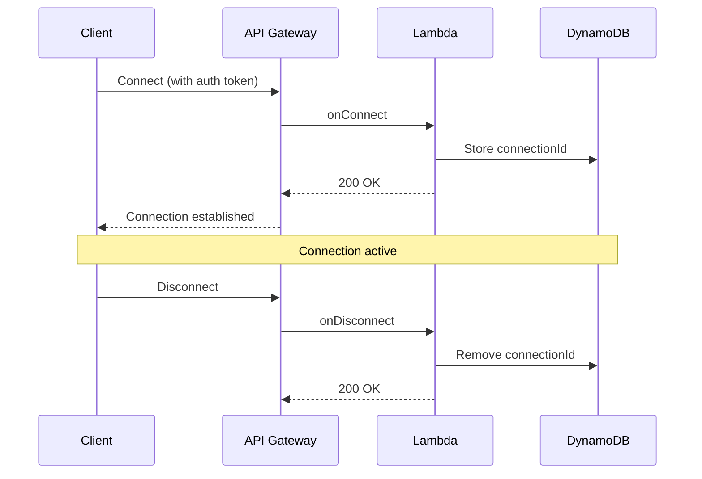

# WebSocket Protocol Specification

## Overview

This document defines the WebSocket message formats for real-time communication between the DevContext AI backend and frontend. WebSocket is used for:

1. **Progressive Result Streaming**: Notify frontend when analysis stages complete
2. **Live Mock Interview**: Real-time question/answer exchange with instant feedback

---

## Connection Management

### WebSocket Endpoint

```
wss://api.devcontext-ai.com/v1/ws
```

### Connection Flow



### Authentication

WebSocket connections MUST include a valid Cognito JWT token in the connection request:

```javascript
const ws = new WebSocket('wss://api.devcontext-ai.com/v1/ws', {
  headers: {
    'Authorization': `Bearer ${cognitoToken}`
  }
});
```

---

## Message Format

All WebSocket messages follow this structure:

```typescript
interface WebSocketMessage {
  type: string;           // Message type identifier
  timestamp: string;      // ISO 8601 timestamp
  payload: any;           // Message-specific data
  requestId?: string;     // Optional request correlation ID
}
```

---

## Message Types

### 1. Client → Server Messages

#### 1.1 Subscribe to Analysis Updates

**Purpose**: Subscribe to real-time updates for a specific analysis

```typescript
{
  type: 'subscribe_analysis',
  timestamp: '2024-02-26T10:30:00Z',
  payload: {
    analysisId: 'a1b2c3d4-e5f6-7890-abcd-ef1234567890'
  }
}
```

**Server Response**:
```typescript
{
  type: 'subscription_confirmed',
  timestamp: '2024-02-26T10:30:00Z',
  payload: {
    analysisId: 'a1b2c3d4-e5f6-7890-abcd-ef1234567890',
    currentStatus: 'processing',
    completedStages: []
  }
}
```

---

#### 1.2 Unsubscribe from Analysis Updates

**Purpose**: Stop receiving updates for a specific analysis

```typescript
{
  type: 'unsubscribe_analysis',
  timestamp: '2024-02-26T10:35:00Z',
  payload: {
    analysisId: 'a1b2c3d4-e5f6-7890-abcd-ef1234567890'
  }
}
```

**Server Response**:
```typescript
{
  type: 'unsubscription_confirmed',
  timestamp: '2024-02-26T10:35:00Z',
  payload: {
    analysisId: 'a1b2c3d4-e5f6-7890-abcd-ef1234567890'
  }
}
```

---

#### 1.3 Start Live Interview

**Purpose**: Initiate a live mock interview session

```typescript
{
  type: 'start_interview',
  timestamp: '2024-02-26T10:40:00Z',
  payload: {
    analysisId: 'a1b2c3d4-e5f6-7890-abcd-ef1234567890',
    sessionType: 'live' | 'practice'
  }
}
```

**Server Response**:
```typescript
{
  type: 'interview_started',
  timestamp: '2024-02-26T10:40:01Z',
  payload: {
    sessionId: 's1b2c3d4-e5f6-7890-abcd-ef1234567890',
    analysisId: 'a1b2c3d4-e5f6-7890-abcd-ef1234567890',
    firstQuestion: {
      questionId: 'q1b2c3d4-e5f6-7890-abcd-ef1234567890',
      question: 'In your UserService.java file, you implemented authentication using JWT tokens. Why did you choose JWT over session-based authentication?',
      category: 'tradeoffs',
      difficulty: 'mid-level',
      fileReferences: ['src/main/java/com/example/UserService.java']
    },
    totalQuestions: 10
  }
}
```

---

#### 1.4 Submit Interview Answer

**Purpose**: Submit an answer to the current interview question

```typescript
{
  type: 'submit_answer',
  timestamp: '2024-02-26T10:42:00Z',
  payload: {
    sessionId: 's1b2c3d4-e5f6-7890-abcd-ef1234567890',
    questionId: 'q1b2c3d4-e5f6-7890-abcd-ef1234567890',
    answer: 'I chose JWT because it is stateless and does not require server-side session storage...'
  }
}
```

**Server Response** (within 5 seconds):
```typescript
{
  type: 'answer_evaluated',
  timestamp: '2024-02-26T10:42:04Z',
  payload: {
    sessionId: 's1b2c3d4-e5f6-7890-abcd-ef1234567890',
    questionId: 'q1b2c3d4-e5f6-7890-abcd-ef1234567890',
    evaluation: {
      score: 75,
      strengths: [
        'Correctly identified stateless nature of JWT',
        'Mentioned scalability benefits'
      ],
      weaknesses: [
        'Did not discuss token expiration strategy',
        'Missing security considerations (token storage)'
      ],
      missingPoints: [
        'Refresh token mechanism',
        'XSS/CSRF protection'
      ],
      feedback: 'Good understanding of JWT basics. Consider discussing security implications and token lifecycle management.'
    },
    nextAction: 'follow_up' | 'next_question' | 'complete'
  }
}
```

---

#### 1.5 Pause Interview

**Purpose**: Pause the current interview session

```typescript
{
  type: 'pause_interview',
  timestamp: '2024-02-26T10:45:00Z',
  payload: {
    sessionId: 's1b2c3d4-e5f6-7890-abcd-ef1234567890'
  }
}
```

**Server Response**:
```typescript
{
  type: 'interview_paused',
  timestamp: '2024-02-26T10:45:00Z',
  payload: {
    sessionId: 's1b2c3d4-e5f6-7890-abcd-ef1234567890',
    currentQuestionIndex: 3,
    canResume: true
  }
}
```

---

#### 1.6 Resume Interview

**Purpose**: Resume a paused interview session

```typescript
{
  type: 'resume_interview',
  timestamp: '2024-02-26T10:50:00Z',
  payload: {
    sessionId: 's1b2c3d4-e5f6-7890-abcd-ef1234567890'
  }
}
```

**Server Response**:
```typescript
{
  type: 'interview_resumed',
  timestamp: '2024-02-26T10:50:00Z',
  payload: {
    sessionId: 's1b2c3d4-e5f6-7890-abcd-ef1234567890',
    currentQuestion: {
      questionId: 'q4b2c3d4-e5f6-7890-abcd-ef1234567890',
      question: '...',
      category: 'implementation',
      difficulty: 'junior'
    }
  }
}
```

---

#### 1.7 Ping (Keep-Alive)

**Purpose**: Keep connection alive and verify connectivity

```typescript
{
  type: 'ping',
  timestamp: '2024-02-26T10:55:00Z',
  payload: {}
}
```

**Server Response**:
```typescript
{
  type: 'pong',
  timestamp: '2024-02-26T10:55:00Z',
  payload: {}
}
```

---

### 2. Server → Client Messages

#### 2.1 Stage Completion Notification

**Purpose**: Notify client when an analysis stage completes

```typescript
{
  type: 'stage_completed',
  timestamp: '2024-02-26T10:30:25Z',
  payload: {
    analysisId: 'a1b2c3d4-e5f6-7890-abcd-ef1234567890',
    stage: 'project_review' | 'intelligence_report' | 'interview_simulation',
    completedStages: ['project_review'],
    progress: 33,
    dataAvailable: true
  }
}
```

**Client Action**: Fetch the completed stage data via REST API

```javascript
// Example client handling
ws.onmessage = (event) => {
  const message = JSON.parse(event.data);
  
  if (message.type === 'stage_completed') {
    const { analysisId, stage } = message.payload;
    
    // Fetch the completed stage data
    fetch(`/api/analysis/${analysisId}`)
      .then(res => res.json())
      .then(data => {
        // Update UI with new data
        updateResultsView(data);
      });
  }
};
```

---

#### 2.2 Analysis Failed

**Purpose**: Notify client when analysis fails

```typescript
{
  type: 'analysis_failed',
  timestamp: '2024-02-26T10:31:00Z',
  payload: {
    analysisId: 'a1b2c3d4-e5f6-7890-abcd-ef1234567890',
    stage: 'project_review',
    errorMessage: 'Repository not found or access denied',
    errorCode: 'REPO_NOT_FOUND',
    retryable: false
  }
}
```

---

#### 2.3 Follow-Up Question

**Purpose**: Ask a follow-up question based on previous answer

```typescript
{
  type: 'follow_up_question',
  timestamp: '2024-02-26T10:42:05Z',
  payload: {
    sessionId: 's1b2c3d4-e5f6-7890-abcd-ef1234567890',
    questionId: 'q2b2c3d4-e5f6-7890-abcd-ef1234567890',
    question: 'You mentioned JWT is stateless. How would you handle token revocation in your implementation?',
    questionType: 'clarifying' | 'deeper_technical',
    relatedToQuestionId: 'q1b2c3d4-e5f6-7890-abcd-ef1234567890'
  }
}
```

---

#### 2.4 Next Question

**Purpose**: Present the next interview question

```typescript
{
  type: 'next_question',
  timestamp: '2024-02-26T10:43:00Z',
  payload: {
    sessionId: 's1b2c3d4-e5f6-7890-abcd-ef1234567890',
    questionId: 'q3b2c3d4-e5f6-7890-abcd-ef1234567890',
    question: 'In your database schema, you used a composite primary key. What were the trade-offs of this decision?',
    category: 'tradeoffs',
    difficulty: 'mid-level',
    fileReferences: ['src/models/schema.sql'],
    questionNumber: 3,
    totalQuestions: 10
  }
}
```

---

#### 2.5 Interview Complete

**Purpose**: Notify client that interview session is complete

```typescript
{
  type: 'interview_complete',
  timestamp: '2024-02-26T11:00:00Z',
  payload: {
    sessionId: 's1b2c3d4-e5f6-7890-abcd-ef1234567890',
    analysisId: 'a1b2c3d4-e5f6-7890-abcd-ef1234567890',
    summary: {
      overallScore: 72,
      categoryScores: {
        architecture: 75,
        implementation: 70,
        tradeoffs: 68,
        scalability: 75
      },
      keyStrengths: [
        'Strong understanding of JWT authentication',
        'Good grasp of database design principles'
      ],
      keyWeaknesses: [
        'Need to discuss security implications more thoroughly',
        'Could improve explanation of scalability considerations'
      ],
      improvementAreas: [
        'Study token lifecycle management',
        'Review OWASP security best practices'
      ],
      questionsAnswered: 10,
      averageResponseTime: '45 seconds'
    }
  }
}
```

---

#### 2.6 Error

**Purpose**: Notify client of errors

```typescript
{
  type: 'error',
  timestamp: '2024-02-26T10:30:00Z',
  payload: {
    errorCode: 'INVALID_MESSAGE_FORMAT' | 'UNAUTHORIZED' | 'SESSION_NOT_FOUND' | 'INTERNAL_ERROR',
    errorMessage: 'Human-readable error message',
    details?: any,
    retryable: boolean
  }
}
```

---

## Connection States

```typescript
enum ConnectionState {
  CONNECTING = 'connecting',
  CONNECTED = 'connected',
  SUBSCRIBED = 'subscribed',
  INTERVIEW_ACTIVE = 'interview_active',
  INTERVIEW_PAUSED = 'interview_paused',
  DISCONNECTING = 'disconnecting',
  DISCONNECTED = 'disconnected',
  ERROR = 'error'
}
```

---

## Error Codes

| Error Code | Description | Retryable |
|------------|-------------|-----------|
| `INVALID_MESSAGE_FORMAT` | Message does not match expected schema | No |
| `UNAUTHORIZED` | Invalid or expired authentication token | No |
| `SESSION_NOT_FOUND` | Interview session does not exist | No |
| `ANALYSIS_NOT_FOUND` | Analysis ID does not exist | No |
| `RATE_LIMIT_EXCEEDED` | Too many messages sent | Yes |
| `INTERNAL_ERROR` | Server-side error | Yes |
| `CONNECTION_TIMEOUT` | Connection timed out | Yes |

---

## Client Implementation Example

### React WebSocket Hook

```typescript
import { useEffect, useRef, useState } from 'react';

interface UseWebSocketOptions {
  url: string;
  authToken: string;
  onMessage: (message: WebSocketMessage) => void;
  onError?: (error: Error) => void;
}

export function useWebSocket({ url, authToken, onMessage, onError }: UseWebSocketOptions) {
  const ws = useRef<WebSocket | null>(null);
  const [isConnected, setIsConnected] = useState(false);

  useEffect(() => {
    // Create WebSocket connection
    ws.current = new WebSocket(url);

    ws.current.onopen = () => {
      console.log('WebSocket connected');
      setIsConnected(true);
      
      // Send authentication
      ws.current?.send(JSON.stringify({
        type: 'authenticate',
        timestamp: new Date().toISOString(),
        payload: { token: authToken }
      }));
    };

    ws.current.onmessage = (event) => {
      try {
        const message = JSON.parse(event.data);
        onMessage(message);
      } catch (error) {
        console.error('Failed to parse WebSocket message:', error);
      }
    };

    ws.current.onerror = (error) => {
      console.error('WebSocket error:', error);
      onError?.(new Error('WebSocket connection error'));
    };

    ws.current.onclose = () => {
      console.log('WebSocket disconnected');
      setIsConnected(false);
    };

    // Cleanup on unmount
    return () => {
      ws.current?.close();
    };
  }, [url, authToken]);

  const sendMessage = (message: WebSocketMessage) => {
    if (ws.current?.readyState === WebSocket.OPEN) {
      ws.current.send(JSON.stringify(message));
    } else {
      console.error('WebSocket is not connected');
    }
  };

  return { isConnected, sendMessage };
}
```

### Usage Example

```typescript
function AnalysisProgress({ analysisId }: { analysisId: string }) {
  const [progress, setProgress] = useState(0);
  const [completedStages, setCompletedStages] = useState<string[]>([]);

  const { isConnected, sendMessage } = useWebSocket({
    url: 'wss://api.devcontext-ai.com/v1/ws',
    authToken: getCognitoToken(),
    onMessage: (message) => {
      if (message.type === 'stage_completed') {
        setProgress(message.payload.progress);
        setCompletedStages(message.payload.completedStages);
        
        // Fetch updated data
        fetchAnalysisData(analysisId);
      }
    },
    onError: (error) => {
      console.error('WebSocket error:', error);
    }
  });

  useEffect(() => {
    if (isConnected) {
      // Subscribe to analysis updates
      sendMessage({
        type: 'subscribe_analysis',
        timestamp: new Date().toISOString(),
        payload: { analysisId }
      });
    }

    return () => {
      // Unsubscribe on unmount
      sendMessage({
        type: 'unsubscribe_analysis',
        timestamp: new Date().toISOString(),
        payload: { analysisId }
      });
    };
  }, [isConnected, analysisId]);

  return (
    <div>
      <ProgressBar value={progress} />
      <StageIndicators completed={completedStages} />
    </div>
  );
}
```

---

## Backend Implementation Notes

### Lambda Handler Structure

```typescript
// onConnect handler
export async function handleConnect(event: APIGatewayWebSocketEvent) {
  const connectionId = event.requestContext.connectionId;
  const token = event.headers?.Authorization?.replace('Bearer ', '');
  
  // Verify token
  const userId = await verifyToken(token);
  
  // Store connection
  await dynamodb.put({
    TableName: 'WebSocketConnections',
    Item: {
      connectionId,
      userId,
      connectedAt: new Date().toISOString(),
      ttl: Math.floor(Date.now() / 1000) + 3600 // 1 hour
    }
  });
  
  return { statusCode: 200 };
}

// onMessage handler
export async function handleMessage(event: APIGatewayWebSocketEvent) {
  const connectionId = event.requestContext.connectionId;
  const message = JSON.parse(event.body || '{}');
  
  switch (message.type) {
    case 'subscribe_analysis':
      await handleSubscribe(connectionId, message.payload);
      break;
    case 'start_interview':
      await handleStartInterview(connectionId, message.payload);
      break;
    case 'submit_answer':
      await handleSubmitAnswer(connectionId, message.payload);
      break;
    // ... other message types
  }
  
  return { statusCode: 200 };
}

// Send message to client
async function sendToClient(connectionId: string, message: WebSocketMessage) {
  const apiGateway = new ApiGatewayManagementApi({
    endpoint: process.env.WEBSOCKET_ENDPOINT
  });
  
  await apiGateway.postToConnection({
    ConnectionId: connectionId,
    Data: JSON.stringify(message)
  });
}
```

---

## Testing

### Manual Testing with wscat

```bash
# Install wscat
npm install -g wscat

# Connect to WebSocket
wscat -c wss://api.devcontext-ai.com/v1/ws -H "Authorization: Bearer YOUR_TOKEN"

# Send subscribe message
> {"type":"subscribe_analysis","timestamp":"2024-02-26T10:30:00Z","payload":{"analysisId":"test-id"}}

# Receive stage completion
< {"type":"stage_completed","timestamp":"2024-02-26T10:30:25Z","payload":{"analysisId":"test-id","stage":"project_review","progress":33}}
```

### Automated Testing

```typescript
import WebSocket from 'ws';

describe('WebSocket Protocol', () => {
  let ws: WebSocket;

  beforeEach(() => {
    ws = new WebSocket('wss://api.devcontext-ai.com/v1/ws', {
      headers: { Authorization: `Bearer ${testToken}` }
    });
  });

  afterEach(() => {
    ws.close();
  });

  it('should receive stage completion notification', (done) => {
    ws.on('open', () => {
      ws.send(JSON.stringify({
        type: 'subscribe_analysis',
        timestamp: new Date().toISOString(),
        payload: { analysisId: 'test-id' }
      }));
    });

    ws.on('message', (data) => {
      const message = JSON.parse(data.toString());
      
      if (message.type === 'stage_completed') {
        expect(message.payload.stage).toBe('project_review');
        done();
      }
    });
  });
});
```

---

## Security Considerations

1. **Authentication**: All connections MUST include valid Cognito JWT token
2. **Authorization**: Users can only subscribe to their own analyses
3. **Rate Limiting**: Limit messages to 100 per minute per connection
4. **Connection Timeout**: Close idle connections after 15 minutes
5. **Message Size**: Limit message size to 128 KB
6. **Validation**: Validate all incoming messages against schema

---

## Performance Considerations

1. **Connection Pooling**: Reuse connections for multiple subscriptions
2. **Message Batching**: Batch multiple stage completions if they occur simultaneously
3. **Compression**: Enable WebSocket compression for large messages
4. **Keep-Alive**: Send ping every 30 seconds to prevent connection timeout
5. **Reconnection**: Implement exponential backoff for reconnection attempts

---

**Document Version**: 1.0  
**Last Updated**: [Current Date]  
**Maintained By**: Both Team Members
