# DevContext.AI

<div align="center">


[](https://aws.amazon.com/)
[](https://reactjs.org/)
[](https://www.typescriptlang.org/)
[](https://aws.amazon.com/bedrock/)

**Transform your GitHub repositories into recruiter-ready intelligence reports**

[Live Demo](#) · [Documentation](docs/) · [API Contract](docs/api-contract.yaml)

</div>

---

## The Problem

Engineering graduates build impressive projects but struggle to articulate their architectural thinking in interviews. Recruiters see code, not the reasoning behind it.

**DevContext.AI bridges this gap** by analyzing your repositories and generating:

- **Employability Signals** — Quantified project quality scores
- **Architecture Intelligence** — AI-reconstructed design decisions
- **Interview Simulations** — Project-specific questions with real-time feedback

---

## ✨ Features

### Three-Stage Analysis Pipeline

```mermaid
flowchart LR
    A[🔗 GitHub URL] --> B[🔬 Stage 1 Project Review]
    B --> C[📊 Stage 2 Intelligence Report]
    C --> D[🎤 Stage 3 Interview Simulation]

    B -.- E[⚡ ~30 seconds]
    C -.- F[🔄 Background]
    D -.- G[🔄 Background]

    style A fill:#f5f5f5,stroke:#333
    style B fill:#5B4FE9,color:#fff
    style C fill:#5B4FE9,color:#fff
    style D fill:#5B4FE9,color:#fff
    style E fill:transparent,stroke:none
    style F fill:transparent,stroke:none
    style G fill:transparent,stroke:none
```



| Stage       | Output                                                                                    | Time        |
| ----------- | ----------------------------------------------------------------------------------------- | ----------- |
| **Stage 1** | Project Review with Employability Score (0-100), Code Quality metrics, Authenticity Score | ~30 seconds |
| **Stage 2** | Intelligence Report with Architecture diagrams, Design decisions, Resume bullet points    | Background  |
| **Stage 3** | Interview Simulation with 10-15 project-specific questions, Live mock interviews          | Background  |

### Key Capabilities

- **Grounded Analysis** — Every claim references specific files and line numbers
- **User Code Focus** — Distinguishes your code from framework boilerplate
- **Honest Feedback** — Direct, actionable insights without false encouragement
- **Live Mock Interviews** — Real-time AI evaluation with follow-up questions
- **Progressive Streaming** — Results delivered as they're ready

---

## Architecture


### Multi-Model Strategy

| Task                | Model         | Rationale                        |
| ------------------- | ------------- | -------------------------------- |
| Project Review      | Claude Haiku  | Structured output, fast response |
| Intelligence Report | Claude Sonnet | Complex architectural reasoning  |
| Interview Questions | Claude Haiku  | Pattern-based generation         |
| Answer Evaluation   | Claude Sonnet | Nuanced feedback                 |

---

## Data Flow

```mermaid
sequenceDiagram
    participant U as User
    participant F as Frontend
    participant A as API Gateway
    participant O as Orchestrator
    participant R as Repo Processor
    participant B as Bedrock
    participant D as DynamoDB

    U->>F: Submit GitHub URL
    F->>A: POST /analyze
    A->>O: Initiate Analysis

    O->>R: Clone & Process Repo
    R->>R: Filter User Code
    R->>R: Generate Context Map
    R-->>O: Repository Ready

    par Stage 1 (Immediate)
        O->>B: Project Review
        B-->>O: Review Complete
        O->>D: Store Results
        O-->>F: Stream Stage 1 ✅
        F-->>U: Show Project Review
    and Stage 2 & 3 (Background)
        O->>B: Intelligence Report
        O->>B: Interview Simulation
        B-->>O: Reports Complete
        O->>D: Store Results
        O-->>F: Stream Stage 2 & 3 ✅
    end

    F-->>U: Full Dashboard Ready
```



---

## Quick Start

### Prerequisites

- Node.js 18+
- AWS CLI configured
- AWS SAM CLI
- AWS Account with Bedrock access (Claude models enabled)

### Installation

```bash
# Clone the repository
git clone https://github.com/Rounakneema/DevContext.AI.git
cd DevContext.AI

# Install frontend dependencies
cd frontend
npm install

# Install backend dependencies
cd ../backend
npm install
```

### Development

```bash
# Start frontend (from /frontend)
npm start

# Build backend (from /backend)
npm run build
sam build
```

### Deployment

```bash
# Deploy backend to AWS (from /backend)
sam deploy --guided

# Build frontend for production (from /frontend)
npm run build
```

---

## Project Structure

```
DevContext.AI/
├── frontend/                   # React Dashboard
│   ├── src/
│   │   ├── components/         # Reusable UI components
│   │   │   ├── Sidebar.tsx
│   │   │   └── dashboard/      # Dashboard tab components
│   │   ├── pages/              # Route pages
│   │   │   ├── HomePage.tsx
│   │   │   ├── LoadingPage.tsx
│   │   │   ├── DashboardPage.tsx
│   │   │   ├── LoginPage.tsx
│   │   │   └── SignupPage.tsx
│   │   ├── contexts/           # React contexts
│   │   └── styles.css          # Global styles
│   └── public/
│
├── backend/                    # AWS SAM Application
│   ├── src/
│   │   ├── orchestrator.ts     # Analysis coordinator
│   │   ├── repo-processor.ts   # Repository processing
│   │   ├── stage1-review.ts    # Project review generator
│   │   ├── stage3-questions.ts # Interview question generator
│   │   ├── answer-eval.ts      # Answer evaluation
│   │   ├── token-budget-manager.ts
│   │   ├── grounding-checker.ts
│   │   └── self-correction.ts
│   ├── shared-types/           # Shared TypeScript types
│   └── template.yaml           # SAM template
│
├── docs/                       # Documentation
│   ├── api-contract.yaml       # OpenAPI specification
│   ├── websocket-protocol.md   # Real-time communication
│   └── mock-api-responses.json # Test data
│
├── design.md                   # System design document
└── requirements.md             # Functional requirements
```

---

## API Endpoints

| Method   | Endpoint                 | Description                   |
| -------- | ------------------------ | ----------------------------- |
| `POST`   | `/analyze`               | Start repository analysis     |
| `GET`    | `/analysis/{id}`         | Get complete analysis results |
| `GET`    | `/analysis/{id}/status`  | Poll analysis progress        |
| `POST`   | `/interview/{id}/answer` | Submit and evaluate answer    |
| `GET`    | `/analysis/history`      | Get user's analysis history   |
| `DELETE` | `/analysis/{id}`         | Delete analysis               |
| `POST`   | `/export/{id}`           | Export report (PDF/Markdown)  |

📖 Full API documentation: [docs/api-contract.yaml](docs/api-contract.yaml)

---

## How It Works

### 1. Repository Processing


**Intelligent Exclusion Filter** removes:

- `node_modules/`, `dist/`, `build/`
- `package-lock.json`, `yarn.lock`
- Binary files, images, secrets
- Generated and minified code

### 2. Grounding & Self-Correction

Every architectural claim is **grounded** in specific code:

```typescript
// ❌ Ungrounded (rejected)
"The project uses MVC architecture"

// ✅ Grounded (accepted)
"The project uses MVC architecture as evidenced by:
 - Controllers: src/controllers/userController.js (L12-45)
 - Models: src/models/User.js (L1-30)
 - Views: src/views/ directory"
```

The **Self-Correction Loop** automatically regenerates any content that references non-existent files.

### 3. Live Mock Interview


---

## Performance Targets

| Metric                  | Target       | Notes              |
| ----------------------- | ------------ | ------------------ |
| Stage 1 delivery        | ≤ 30 seconds | Project Review     |
| Full analysis (< 50MB)  | ≤ 90 seconds | All three stages   |
| Full analysis (< 200MB) | ≤ 3 minutes  | All three stages   |
| Answer evaluation       | ≤ 10 seconds | Live interview     |
| Concurrent analyses     | 10+          | Lambda concurrency |

---

## Cost Optimization

- **Multi-Model Strategy**: Haiku for structured tasks, Sonnet for reasoning
- **Token Budget Manager**: Intelligent truncation at 50K tokens
- **Prompt Caching**: Cached analysis for common framework patterns
- **Serverless Architecture**: Pay-per-execution, no idle costs
- **24-hour Cache**: Avoid redundant analysis

---

## Security

- AWS Cognito authentication
- All data encrypted at rest (KMS) and in transit (TLS 1.2+)
- No permanent code storage — repos deleted after analysis
- Short-lived GitHub tokens for private repos
- User-scoped access — only see your own analyses

---

## Roadmap

- [x] Core analysis pipeline
- [x] React dashboard
- [x] Real-time progress streaming
- [x] Live mock interviews
- [ ] Voice input for interviews
- [ ] PDF export
- [ ] Adaptive learning paths
- [ ] Multi-language support (Hindi, etc.)
- [ ] VS Code extension

---

## 🤝 Contributing

Contributions are welcome! Please read our contributing guidelines before submitting PRs.

1. Fork the repository
2. Create a feature branch (`git checkout -b feature/amazing-feature`)
3. Commit changes (`git commit -m 'Add amazing feature'`)
4. Push to branch (`git push origin feature/amazing-feature`)
5. Open a Pull Request

---

## License

This project is licensed under the MIT License — see the [LICENSE](LICENSE) file for details.

## Team

Built with <3 for the **AWS AI for Bharat Hackathon**

<div align="center">

**[⬆ Back to Top](#devcontextai)**

</div>
