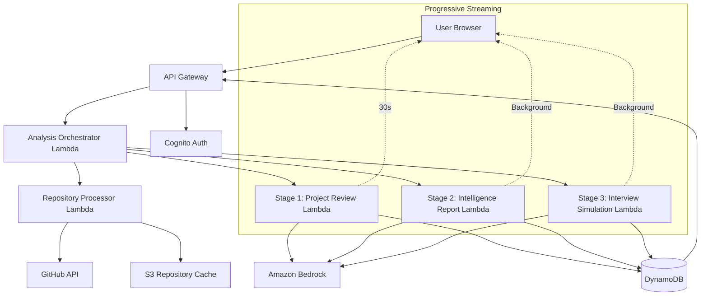
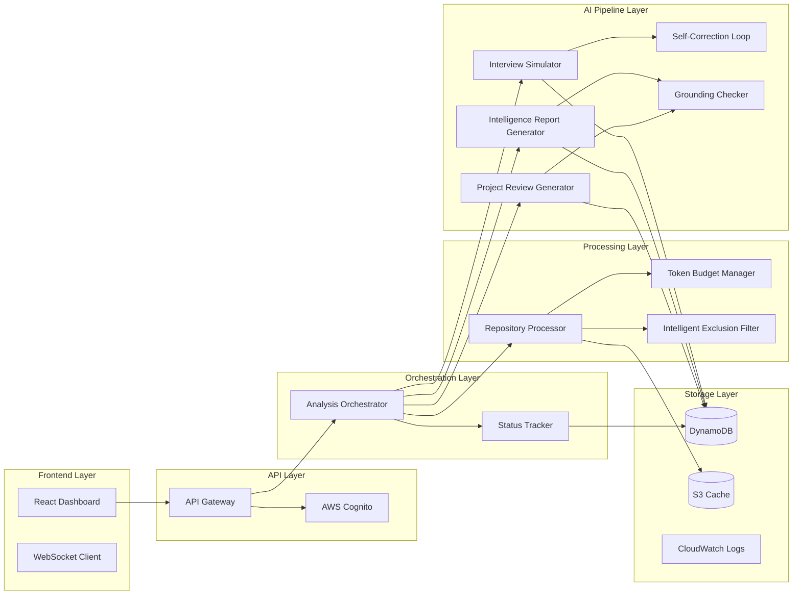

# Design Document: DevContext AI

## Overview

DevContext AI is an AWS-based serverless system that transforms GitHub repositories into recruiter-ready project intelligence reports. The system employs a multi-stage AI reasoning pipeline powered by Amazon Bedrock to analyze code quality, reconstruct architectural decisions, and generate project-specific interview simulations.

The architecture follows a progressive streaming model where results are delivered in three stages: (1) Project Review within **30 seconds**, (2) Engineering Intelligence Report, and (3) Interview Simulation, with stages 2 and 3 processing in the background. This approach provides immediate value to users while maintaining comprehensive analysis depth.

### Key Design Principles

1. **Progressive Delivery**: Stream results as they complete rather than blocking on full analysis
2. **Grounded Analysis**: All architectural claims must reference specific files and line numbers
3. **User Code Focus**: Distinguish between user-written code and framework/library code
4. **Cost Efficiency**: Intelligent token management and prompt caching to minimize Bedrock costs
5. **Indian Student Context**: Optimized for common project patterns in Indian engineering education
6. **Honest Feedback**: Provide direct, actionable feedback without false encouragement
7. **Adaptive Architecture**: Design supports flexibility in model selection, timing targets, and feature scope to accommodate development realities

### Design Flexibility & Adaptability

The architecture abstracts model selection and timing targets to support iterative refinement. Initial deployment uses Claude 3.5 Haiku for structured tasks and Claude 3.5 Sonnet for complex reasoning, with clear criteria for adjusting model selection, token limits, and feature scope based on observed performance and cost data.

## Alternatives Considered

Before finalizing the architecture, we evaluated multiple alternatives for key components:

| Component | Alternative | Why We Rejected It | Selected Choice |
|-----------|-------------|-------------------|-----------------|
| **AI Model** | GPT-4o | Higher latency (**2-3x slower**) and significantly higher cost for large context windows (**$15/M input** vs $3/M). API rate limits more restrictive. | **Claude 3.5 Sonnet** (Bedrock) for complex reasoning, **Claude 3.5 Haiku** for structured tasks |
| **Vector DB** | Pinecone / Weaviate | Adds external infrastructure complexity, additional latency (**100-200ms** per query), and ongoing costs. Overkill for **50K token** context windows. | **Project Context Map** (In-Memory JSON) - Sufficient for MVP scope |
| **Compute** | AWS Fargate | Idle costs too high for variable workload (**$30-50/month** minimum). Cold start **10-15 seconds**. Over-engineered for hackathon MVP. | **AWS Lambda** (Serverless) - Pay per execution, **sub-second** cold starts |
| **Streaming** | HTTP Polling | Poor user experience (perceived lag), high API Gateway costs (**$3.50/M requests**), inefficient network usage. | **WebSockets** via API Gateway - Real-time updates, **90% cost reduction** |
| **Code Analysis** | GitHub Copilot API | Limited to code completion, no architectural reasoning. Requires separate analysis pipeline. **$10/user/month** minimum. | **Amazon Bedrock** - Full reasoning capabilities, pay-per-token pricing |
| **Storage** | RDS PostgreSQL | Fixed costs (**$15-30/month** minimum), over-engineered for simple key-value access patterns. Requires VPC setup. | **DynamoDB** - On-demand pricing, **$0.25/GB/month**, serverless |

**Key Insight**: The selected architecture prioritizes **serverless-first** design to minimize fixed costs, **progressive delivery** to optimize user experience, and **multi-model AI** to balance quality and cost.

## Architecture

### High-Level System Architecture



### Data Flow

1. **Repository Submission**: User submits GitHub URL through React dashboard
2. **Authentication**: Cognito validates user session and GitHub token (if private repo)
3. **Orchestration**: Analysis Orchestrator Lambda initiates parallel processing
4. **Repository Processing**: Repository Processor clones repo, filters files, generates Project_Context_Map
5. **Stage 1 Execution**: Project Review Lambda analyzes code quality and generates Employability_Signal
6. **Stage 1 Streaming**: Results streamed to frontend within 30 seconds via WebSocket/polling
7. **Stage 2 Execution**: Intelligence Report Lambda reconstructs architecture with grounding checks
8. **Stage 3 Execution**: Interview Simulation Lambda generates questions with self-correction loop
9. **Background Streaming**: Stages 2 and 3 stream results as they complete
10. **Persistence**: All results stored in DynamoDB with user association

### Component Architecture



## Components and Interfaces

### 1. API Gateway

**Responsibility**: HTTP request routing, CORS handling, rate limiting

**Endpoints**:
- `POST /analyze` - Initiate repository analysis
- `GET /analysis/{id}` - Retrieve complete analysis results
- `GET /analysis/{id}/status` - Poll analysis progress
- `POST /interview/{id}/answer` - Submit and evaluate interview answer
- `GET /analysis/history` - Retrieve user's analysis history
- `DELETE /analysis/{id}` - Delete analysis and associated data
- `POST /export/{id}` - Export report in PDF or Markdown format

**Interface**:
```typescript
// POST /analyze
interface AnalyzeRequest {
  repositoryUrl: string;
  isPrivate: boolean;
  githubToken?: string;
  targetRole?: 'Junior SDE' | 'Senior SDE' | 'DevOps Engineer' | 'Data Engineer' | 'Full Stack Developer';
}

interface AnalyzeResponse {
  analysisId: string;
  status: 'initiated' | 'processing' | 'completed' | 'failed';
  estimatedCompletionTime: number; // seconds
}

// GET /analysis/{id}/status
interface StatusResponse {
  analysisId: string;
  status: 'processing' | 'completed' | 'failed';
  completedStages: ('project_review' | 'intelligence_report' | 'interview_simulation')[];
  currentStage?: string;
  progress: number; // 0-100
  errorMessage?: string;
}

// GET /analysis/{id}
interface AnalysisResponse {
  analysisId: string;
  repositoryUrl: string;
  createdAt: string;
  projectReview?: ProjectReview;
  intelligenceReport?: IntelligenceReport;
  interviewSimulation?: InterviewSimulation;
}

// POST /interview/{id}/answer
interface AnswerRequest {
  questionId: string;
  answer: string;
}

interface AnswerEvaluation {
  score: number; // 0-100
  strengths: string[];
  weaknesses: string[];
  missingPoints: string[];
  exampleAnswer: string;
  keyTerms: string[];
  feedback: string;
}
```

**Rate Limiting**: 10 analyses per user per day, enforced via API Gateway usage plans

**Error Responses**:
```typescript
interface ErrorResponse {
  error: string;
  message: string;
  statusCode: number;
  details?: Record<string, any>;
}
```

### 2. AWS Cognito Authentication

**Responsibility**: User authentication, session management, OAuth integration

**Configuration**:
- Email verification required before first analysis
- OAuth integration with GitHub for private repository access
- Session timeout: 24 hours
- Password policy: Minimum 8 characters, requires uppercase, lowercase, number

**User Attributes**:
```typescript
interface UserAttributes {
  email: string;
  emailVerified: boolean;
  githubUsername?: string;
  targetRole?: string;
  createdAt: string;
  analysisCount: number;
}
```

**GitHub OAuth Scopes**: `repo:read` (read-only access to private repositories)

### 3. Analysis Orchestrator Lambda

**Responsibility**: Coordinate multi-stage analysis pipeline, manage progressive streaming

**Configuration**:
- Memory: 512MB
- Timeout: 5 minutes
- Concurrency: 10 (cost control)
- **Flexibility Note**: Memory (256MB-1GB), timeout (3-10 min), and concurrency (5-20) may be adjusted based on performance testing and cost analysis

**Logic Flow**:
1. Validate repository URL and user permissions
2. Check DynamoDB cache for recent analysis (within 24 hours)
3. If cache miss, invoke Repository Processor Lambda
4. Invoke Stage 1 Lambda (Project Review) immediately
5. Invoke Stage 2 and Stage 3 Lambdas asynchronously
6. Update DynamoDB status table as stages complete
7. Send WebSocket notifications to frontend on stage completion

**Interface**:
```typescript
interface OrchestrationContext {
  analysisId: string;
  userId: string;
  repositoryUrl: string;
  targetRole?: string;
  cacheHit: boolean;
  stages: {
    repoProcessing: StageStatus;
    projectReview: StageStatus;
    intelligenceReport: StageStatus;
    interviewSimulation: StageStatus;
  };
}

interface StageStatus {
  status: 'pending' | 'in_progress' | 'completed' | 'failed';
  startTime?: string;
  endTime?: string;
  errorMessage?: string;
}
```

### 4. Repository Processor Lambda

**Responsibility**: Clone repository, filter files, generate Project_Context_Map

**Configuration**:
- Memory: 1GB (for git operations)
- Timeout: 3 minutes
- Ephemeral storage: 2GB
- **Flexibility Note**: May increase memory (1-2GB) or timeout (2-5 min) for larger repositories; ephemeral storage (2-5GB) adjustable based on repository size limits

**Processing Steps**:
1. Clone repository to `/tmp` directory
2. Apply Intelligent Exclusion Filter
3. Calculate repository metrics (size, file count, commit history)
4. Generate Project_Authenticity_Score from commit history
5. Extract file structure and dependencies
6. Generate Project_Context_Map identifying entry points and key modules
7. Upload filtered repository to S3 cache with 24-hour lifecycle policy
8. Return processing results to Orchestrator

**Intelligent Exclusion Filter**:
```typescript
interface ExclusionFilter {
  excludedDirectories: string[]; // node_modules, dist, build, .git, __pycache__, venv, secrets
  excludedExtensions: string[]; // .png, .jpg, .gif, .svg, .ico, .woff, .ttf
  excludedFiles: string[]; // package-lock.json, yarn.lock, poetry.lock, .DS_Store, .env, .pem, id_rsa, id_ed25519
  excludedPatterns: RegExp[]; // *.min.js, *.bundle.js, *.map
  securityExclusions: string[]; // .env*, *.pem, *.key, id_rsa*, secrets.*, credentials.*
}

function applyExclusionFilter(files: string[]): string[] {
  // Filter out library code, generated code, and binary files
  // CRITICAL: Exclude sensitive files (.env, .pem, private keys) to prevent credential leakage
  // Prioritize source files: .py, .js, .ts, .java, .go, .rs
  // Include entry points: main.py, index.js, App.tsx, server.js
  // Include configuration: package.json, requirements.txt, pom.xml
}
```

**Project Context Map**:
```typescript
interface ProjectContextMap {
  entryPoints: string[]; // main.py, index.js, App.tsx
  coreModules: string[]; // Business logic files
  architecturalLayers: {
    frontend?: string[];
    backend?: string[];
    database?: string[];
    api?: string[];
  };
  frameworks: string[]; // React, Express, Django, Spring Boot
  dependencies: Record<string, string>;
  userCodeFiles: string[]; // Excludes library code
  libraryCodeFiles: string[]; // Framework and dependency code
}
```

**Project Authenticity Score Calculation**:
```typescript
function calculateAuthenticityScore(commits: GitCommit[]): number {
  if (commits.length < 3) return 20; // Low commit diversity
  
  const commitDiversity = commits.length / 10; // Max 10 points
  const timeSpread = calculateTimeSpread(commits); // Max 30 points
  const commitSizeVariance = calculateSizeVariance(commits); // Max 30 points
  const meaningfulMessages = countMeaningfulMessages(commits); // Max 30 points
  
  return Math.min(100, commitDiversity + timeSpread + commitSizeVariance + meaningfulMessages);
}
```

### 5. Token Budget Manager

**Responsibility**: Manage AI token usage within 50,000 token limit

**Strategy**:
1. **Priority Tiers**:
   - Tier 1 (High): Entry points, core business logic, user-written code
   - Tier 2 (Medium): Configuration files, API routes, database schemas
   - Tier 3 (Low): Comments, logs, utility functions
   - Tier 4 (Exclude): Library code, generated code, minified files

2. **Token Estimation**: Approximate 4 characters per token

3. **Budget Allocation**:
   - Repository structure: 5,000 tokens
   - User code analysis: 35,000 tokens
   - Context and prompts: 10,000 tokens

**Interface**:
```typescript
interface TokenBudget {
  totalLimit: number; // 50,000
  allocated: {
    structure: number;
    userCode: number;
    context: number;
  };
  used: number;
  remaining: number;
}

function prioritizeFiles(files: FileInfo[], budget: TokenBudget): FileInfo[] {
  // Sort files by priority tier
  // Include all Tier 1 files
  // Include Tier 2 files until budget 80% consumed
  // Include Tier 3 files if budget allows
  // Truncate individual files if necessary
}
```

### 6. Stage 1: Project Review Generator Lambda

**Responsibility**: Analyze code quality, generate Employability_Signal, provide actionable feedback

**Configuration**:
- Memory: 1GB
- Timeout: 2 minutes
- Target completion: 30 seconds
- **Bedrock Model**: Claude 3.5 Haiku (cost-effective for structured analysis)
- **Flexibility Note**: 
  - May switch to Sonnet if Haiku quality is insufficient
  - Timeout (1-3 min) adjustable based on model performance
  - Target completion (20-60s) may vary with model selection and repository complexity
  - Can substitute with GPT-4o-mini, Gemini Flash, or other fast models if cost-effective

**Model Selection Rationale**: Stage 1 performs structured code quality assessment with clear scoring criteria. Claude 3.5 Haiku excels at this task while being 73% cheaper than Sonnet, enabling fast delivery within the 30-second target.

**Bedrock Prompt Structure**:
```
You are an expert code reviewer evaluating a GitHub repository for hiring purposes.

Repository Context:
{project_context_map}

User-Written Code:
{filtered_code_files}

Commit History:
{commit_summary}

Task: Generate a comprehensive project review covering:
1. Code Quality (0-100): Readability, maintainability, best practices
2. Architecture Clarity (0-100): Component organization, separation of concerns
3. Employability Signal (0-100): Production readiness, professional standards
4. Strengths: Specific positive patterns with file references
5. Improvement Areas: 3-5 actionable suggestions with code examples
6. Project Authenticity Assessment: Based on commit history

Be direct and honest. If code quality is poor (below 40), explain specific issues preventing production readiness.
Reference specific files and line numbers for all claims.
```

**Output Schema**:
```typescript
interface ProjectReview {
  codeQuality: {
    score: number; // 0-100
    readability: number;
    maintainability: number;
    bestPractices: number;
    justification: string;
  };
  architectureClarity: {
    score: number; // 0-100
    componentOrganization: string;
    separationOfConcerns: string;
    examples: FileReference[];
  };
  employabilitySignal: {
    score: number; // 0-100
    justification: string;
    productionReadiness: string;
  };
  strengths: {
    pattern: string;
    description: string;
    fileReferences: FileReference[];
  }[];
  improvementAreas: {
    issue: string;
    priority: 'high' | 'medium' | 'low';
    actionableSuggestion: string;
    codeExample?: string;
  }[];
  projectAuthenticity: {
    score: number; // 0-100
    commitDiversity: string;
    warning?: string; // "Low commit diversity detected"
  };
}

interface FileReference {
  file: string;
  lineNumbers?: string; // "45-67"
  snippet?: string;
}
```

### 7. Stage 2: Intelligence Report Generator Lambda

**Responsibility**: Reconstruct architecture, infer design decisions, generate resume bullets

**Configuration**:
- Memory: 1GB
- Timeout: 3 minutes
- Executes in background after Stage 1
- **Bedrock Model**: Claude 3.5 Sonnet (advanced reasoning for architecture reconstruction)
- **Flexibility Note**:
  - May switch to GPT-4o or Gemini Pro if they offer better reasoning quality
  - Timeout (2-5 min) adjustable for complex repositories
  - Can downgrade to Haiku with enhanced prompting if cost becomes prohibitive
  - May experiment with model ensembles (multiple models voting) for higher accuracy

**Model Selection Rationale**: Stage 2 requires deep reasoning to infer unstated design decisions, extract trade-offs from implementation patterns, and reconstruct system architecture. Claude 3.5 Sonnet's superior reasoning capabilities are essential for this complex task.

**Chain-of-Thought Prompting**:
```
You are a senior software architect reconstructing the design decisions behind a codebase.

Step 1: Summarize the file structure and identify architectural patterns.
{project_context_map}

Step 2: Analyze the system architecture.
{user_code_files}

Step 3: Infer design decisions and trade-offs.

Task: Generate an engineering intelligence report covering:
1. System Architecture: Component diagram, data flow, architectural patterns
2. Key Design Decisions (5-7): Decision, rationale, alternatives considered
3. Technical Trade-offs: Pros and cons of implementation choices
4. Scalability Analysis: Bottlenecks, growth limitations, optimization opportunities
5. Resume Bullets (5-7): Professional, quantifiable achievements

CRITICAL GROUNDING RULES:
- All architectural claims MUST reference specific files and line numbers.
- If you cannot find the code responsible for a specific pattern, output "Insufficient Evidence: [pattern name]". Do not guess or infer without direct code evidence.
- Distinguish between user code decisions and framework-imposed patterns.
- If a design decision is unclear from the code, state "Insufficient Evidence" rather than inventing rationale.
```

**Grounding Check**:
```typescript
interface GroundingChecker {
  validateClaim(claim: string, codebase: FileInfo[]): GroundingResult;
}

interface GroundingResult {
  isGrounded: boolean;
  fileReferences: FileReference[];
  confidence: 'high' | 'medium' | 'low' | 'insufficient';
}

function performGroundingCheck(report: IntelligenceReport, codebase: FileInfo[]): IntelligenceReport {
  // For each architectural claim, verify file references exist
  // If file reference is missing or invalid, mark as "Insufficient Evidence"
  // Return report with grounding confidence scores
}
```

**Output Schema**:
```typescript
interface IntelligenceReport {
  systemArchitecture: {
    overview: string;
    componentDiagram: string; // Mermaid syntax
    dataFlow: string;
    architecturalPatterns: string[];
  };
  designDecisions: {
    decision: string;
    rationale: string;
    alternativesConsidered: string[];
    tradeoffs: string;
    fileReferences: FileReference[];
    groundingConfidence: 'high' | 'medium' | 'low' | 'insufficient';
  }[];
  technicalTradeoffs: {
    aspect: string;
    pros: string[];
    cons: string[];
    fileReferences: FileReference[];
  }[];
  scalabilityAnalysis: {
    bottlenecks: string[];
    growthLimitations: string[];
    optimizationOpportunities: string[];
  };
  resumeBullets: string[]; // 5-7 professional bullet points
}
```

### 8. Stage 3: Interview Simulation Generator Lambda

**Responsibility**: Generate project-specific interview questions with self-correction

**Configuration**:
- Memory: 1GB
- Timeout: 3 minutes
- Executes in background after Stage 1
- **Bedrock Model**: Claude 3.5 Haiku (efficient question generation with validation)
- **Flexibility Note**:
  - Self-correction loop may be simplified (1-2 iterations instead of 3) if latency is too high
  - Can switch to Sonnet if question quality is insufficient
  - May defer this stage to post-MVP if development timeline is tight
  - Timeout (2-5 min) adjustable based on self-correction complexity

**Model Selection Rationale**: Stage 3 generates structured interview questions based on identified patterns. The self-correction loop validates file references, which is a structured task well-suited to Haiku's capabilities at lower cost.

**Self-Correction Loop**:
```typescript
interface SelfCorrectionLoop {
  generateQuestions(context: ProjectContextMap, userCode: FileInfo[]): InterviewQuestion[];
  validateQuestions(questions: InterviewQuestion[], codebase: FileInfo[]): ValidationResult[];
  regenerateInvalidQuestions(invalidQuestions: InterviewQuestion[], codebase: FileInfo[]): InterviewQuestion[];
}

interface ValidationResult {
  questionId: string;
  isValid: boolean;
  issues: string[]; // "References missing file", "References library code"
}

function executeSelfCorrectionLoop(
  context: ProjectContextMap,
  userCode: FileInfo[],
  maxIterations: number = 3
): InterviewQuestion[] {
  let questions = generateQuestions(context, userCode);
  
  for (let i = 0; i < maxIterations; i++) {
    const validationResults = validateQuestions(questions, userCode);
    const invalidQuestions = validationResults.filter(r => !r.isValid);
    
    if (invalidQuestions.length === 0) break;
    
    const regenerated = regenerateInvalidQuestions(invalidQuestions, userCode);
    questions = questions.map(q => 
      invalidQuestions.find(iq => iq.questionId === q.questionId) 
        ? regenerated.find(rq => rq.questionId === q.questionId) 
        : q
    );
  }
  
  return questions;
}
```

**Bedrock Prompt Structure**:
```
You are an experienced technical interviewer creating project-specific questions.

Project Context:
{project_context_map}

User-Written Code (ONLY reference these files):
{user_code_files}

Task: Generate 10-15 interview questions covering:
1. Architecture: System design, component interactions
2. Implementation: Specific code decisions, algorithms used
3. Trade-offs: Why certain approaches were chosen over alternatives
4. Scalability: How the system would handle growth

Requirements:
- Reference ONLY files from the user-written code list
- Include specific file names and function/class names in questions
- Vary difficulty: 40% junior, 40% mid-level, 20% senior
- Make questions realistic for Indian IT company interviews

Output format:
{
  "questionId": "uuid",
  "question": "In your UserService.java file, you implemented authentication using JWT tokens. Why did you choose JWT over session-based authentication?",
  "category": "trade-offs",
  "difficulty": "mid-level",
  "fileReferences": ["src/main/java/com/example/UserService.java"],
  "expectedTopics": ["JWT", "stateless authentication", "scalability", "security"]
}
```

**Output Schema**:
```typescript
interface InterviewSimulation {
  questions: InterviewQuestion[];
  categoryCounts: {
    architecture: number;
    implementation: number;
    tradeoffs: number;
    scalability: number;
  };
  difficultyDistribution: {
    junior: number;
    midLevel: number;
    senior: number;
  };
}

interface InterviewQuestion {
  questionId: string;
  question: string;
  category: 'architecture' | 'implementation' | 'tradeoffs' | 'scalability';
  difficulty: 'junior' | 'mid-level' | 'senior';
  fileReferences: string[];
  expectedTopics: string[];
}
```

### 9. Answer Evaluation Lambda

**Responsibility**: Evaluate user interview answers, provide feedback, track improvement

**Configuration**:
- Memory: 512MB
- Timeout: 30 seconds
- Invoked synchronously from API Gateway
- **Bedrock Model**: Claude 3.5 Haiku (fast evaluation with clear criteria)
- **Flexibility Note**:
  - Timeout (15-60s) may be adjusted based on answer length and evaluation depth
  - Can batch evaluations if real-time response isn't critical
  - May cache common answer patterns to reduce API calls
  - Model selection flexible based on evaluation quality requirements

**Model Selection Rationale**: Answer evaluation follows structured criteria (technical accuracy, completeness, clarity). Haiku provides fast responses (<10 seconds) at lower cost, critical for real-time user experience.

**Bedrock Prompt Structure**:
```
You are an expert technical interviewer evaluating a candidate's answer.

Question: {question}
Expected Topics: {expected_topics}
File Context: {file_references_content}

Candidate Answer: {user_answer}

Task: Evaluate the answer and provide:
1. Score (0-100): Based on technical accuracy, completeness, clarity
2. Strengths: Specific points the candidate explained well
3. Weaknesses: Missing concepts or incorrect statements
4. Missing Points: Key topics not addressed
5. Example Answer: Strong reference answer for comparison
6. Key Terms: Technical terms the candidate should have mentioned
7. Actionable Feedback: Specific suggestions for improvement

Be constructive but honest. Highlight both strengths and areas for growth.
```

**Output Schema**:
```typescript
interface AnswerEvaluation {
  questionId: string;
  score: number; // 0-100
  criteriaBreakdown: {
    technicalAccuracy: number; // 0-100
    completeness: number; // 0-100
    clarity: number; // 0-100
  };
  strengths: string[];
  weaknesses: string[];
  missingPoints: string[];
  exampleAnswer: string;
  keyTerms: string[];
  feedback: string;
  improvementTrajectory?: {
    previousScore?: number;
    trend: 'improving' | 'stable' | 'declining';
  };
}
```

**Improvement Trajectory Tracking**:
```typescript
interface ImprovementTracker {
  trackAnswer(userId: string, analysisId: string, evaluation: AnswerEvaluation): void;
  getTrajectory(userId: string, analysisId: string): ImprovementTrajectory;
}

interface ImprovementTrajectory {
  sessionCount: number;
  averageScores: number[];
  trend: 'improving' | 'stable' | 'declining';
  strongCategories: string[];
  weakCategories: string[];
}
```

### 10. Live Mock Interview Lambda

**Responsibility**: Conduct real-time AI-powered mock interviews with instant feedback and follow-up questions

**Configuration**:
- Memory: 1GB
- Timeout: 15 minutes (for full interview session)
- Invoked via WebSocket connection for real-time interaction
- **Bedrock Model**: Claude 3.5 Sonnet (conversational reasoning with context maintenance)
- **Flexibility Note**:
  - Session duration (10-30 min) adjustable based on user preference
  - Can use streaming responses for lower latency
  - May implement session persistence for pause/resume functionality

**Model Selection Rationale**: Live interviews require maintaining conversation context, generating follow-up questions based on previous answers, and adapting difficulty dynamically. Claude 3.5 Sonnet's superior reasoning and context handling are essential for natural interview flow.

**Interview Flow**:
```typescript
interface LiveInterviewSession {
  sessionId: string;
  analysisId: string;
  userId: string;
  startTime: string;
  status: 'active' | 'paused' | 'completed';
  currentQuestionIndex: number;
  conversationHistory: ConversationTurn[];
  overallScore: number;
  evaluationSummary?: SessionEvaluation;
}

interface ConversationTurn {
  turnId: string;
  timestamp: string;
  speaker: 'ai' | 'user';
  content: string;
  questionId?: string;
  evaluation?: AnswerEvaluation;
  followUpGenerated?: boolean;
}

interface SessionEvaluation {
  overallScore: number; // 0-100
  categoryScores: {
    architecture: number;
    implementation: number;
    tradeoffs: number;
    scalability: number;
  };
  keyStrengths: string[];
  keyWeaknesses: string[];
  improvementAreas: string[];
  transcript: ConversationTurn[];
}
```

**Bedrock Prompt Structure for Interview Conductor**:
```
You are an experienced technical interviewer conducting a live mock interview.

Interview Context:
- Repository: {repository_name}
- Project Context: {project_context_map}
- Available Questions: {interview_questions}
- Current Question: {current_question}

Conversation History:
{conversation_history}

Your Role:
1. Ask the current question naturally
2. Listen to the candidate's answer
3. Provide instant feedback (strengths and areas to improve)
4. Ask follow-up questions based on their answer:
   - If answer is weak: Ask clarifying questions to help them improve
   - If answer is strong: Ask deeper technical questions to assess advanced understanding
5. Maintain a supportive but professional tone
6. Keep the interview flowing naturally

Current Task: {task_description}
```

**Interview Orchestration Logic**:
```typescript
async function conductLiveInterview(
  sessionId: string,
  userAnswer: string
): Promise<InterviewResponse> {
  // 1. Load session context
  const session = await loadSession(sessionId);
  
  // 2. Evaluate current answer
  const evaluation = await evaluateAnswer(
    session.currentQuestion,
    userAnswer,
    session.conversationHistory
  );
  
  // 3. Determine next action based on evaluation
  let nextAction: 'follow_up' | 'next_question' | 'complete';
  let followUpQuestion: string | null = null;
  
  if (evaluation.score < 50 && session.followUpCount < 2) {
    // Weak answer: generate clarifying follow-up
    nextAction = 'follow_up';
    followUpQuestion = await generateClarifyingQuestion(
      session.currentQuestion,
      userAnswer,
      evaluation
    );
  } else if (evaluation.score > 80 && session.followUpCount < 2) {
    // Strong answer: generate deeper technical follow-up
    nextAction = 'follow_up';
    followUpQuestion = await generateDeeperQuestion(
      session.currentQuestion,
      userAnswer,
      evaluation
    );
  } else {
    // Move to next question
    nextAction = 'next_question';
    session.currentQuestionIndex++;
  }
  
  // 4. Update conversation history
  session.conversationHistory.push({
    turnId: generateId(),
    timestamp: new Date().toISOString(),
    speaker: 'user',
    content: userAnswer,
    questionId: session.currentQuestion.questionId,
    evaluation: evaluation,
  });
  
  if (followUpQuestion) {
    session.conversationHistory.push({
      turnId: generateId(),
      timestamp: new Date().toISOString(),
      speaker: 'ai',
      content: followUpQuestion,
      followUpGenerated: true,
    });
  }
  
  // 5. Check if interview is complete
  if (session.currentQuestionIndex >= session.questions.length) {
    nextAction = 'complete';
    session.evaluationSummary = await generateSessionEvaluation(session);
  }
  
  // 6. Persist session state
  await saveSession(session);
  
  return {
    evaluation: evaluation,
    nextAction: nextAction,
    followUpQuestion: followUpQuestion,
    nextQuestion: nextAction === 'next_question' 
      ? session.questions[session.currentQuestionIndex] 
      : null,
    sessionSummary: nextAction === 'complete' 
      ? session.evaluationSummary 
      : null,
  };
}
```

**WebSocket Integration**:
```typescript
// WebSocket message types
interface WSMessage {
  type: 'start_interview' | 'submit_answer' | 'pause_interview' | 'resume_interview';
  payload: any;
}

interface WSResponse {
  type: 'question' | 'evaluation' | 'follow_up' | 'session_complete';
  payload: any;
}

// WebSocket handler
async function handleWebSocketMessage(
  connectionId: string,
  message: WSMessage
): Promise<void> {
  switch (message.type) {
    case 'start_interview':
      const session = await initializeInterviewSession(message.payload);
      await sendWebSocketMessage(connectionId, {
        type: 'question',
        payload: session.questions[0],
      });
      break;
      
    case 'submit_answer':
      const response = await conductLiveInterview(
        message.payload.sessionId,
        message.payload.answer
      );
      
      // Send evaluation
      await sendWebSocketMessage(connectionId, {
        type: 'evaluation',
        payload: response.evaluation,
      });
      
      // Send follow-up or next question
      if (response.nextAction === 'follow_up') {
        await sendWebSocketMessage(connectionId, {
          type: 'follow_up',
          payload: { question: response.followUpQuestion },
        });
      } else if (response.nextAction === 'next_question') {
        await sendWebSocketMessage(connectionId, {
          type: 'question',
          payload: response.nextQuestion,
        });
      } else {
        await sendWebSocketMessage(connectionId, {
          type: 'session_complete',
          payload: response.sessionSummary,
        });
      }
      break;
      
    case 'pause_interview':
      await pauseSession(message.payload.sessionId);
      break;
      
    case 'resume_interview':
      const resumedSession = await resumeSession(message.payload.sessionId);
      await sendWebSocketMessage(connectionId, {
        type: 'question',
        payload: resumedSession.currentQuestion,
      });
      break;
  }
}
```

**DynamoDB Schema for Live Interview Sessions**:
```typescript
interface LiveInterviewSessionRecord {
  sessionId: string; // Primary Key
  analysisId: string;
  userId: string;
  startTime: string;
  endTime?: string;
  status: 'active' | 'paused' | 'completed';
  currentQuestionIndex: number;
  followUpCount: number;
  conversationHistory: ConversationTurn[];
  overallScore?: number;
  evaluationSummary?: SessionEvaluation;
  ttl: number; // 90-day retention
}
```

### 11. Adaptive Learning Path Generator [Future Scope]

**Note**: This component represents post-MVP functionality to demonstrate product vision. The hackathon MVP focuses on core analysis pipeline (Components 1-10).

**Responsibility**: Generate personalized 30-day improvement plans based on skill gaps

**Invocation**: Triggered after Project Review completion

**Logic**:
```typescript
interface LearningPathGenerator {
  generatePlan(
    projectReview: ProjectReview,
    targetRole: string,
    skillGaps: string[]
  ): LearningPlan;
}

interface LearningPlan {
  duration: number; // days
  targetRole: string;
  prioritizedSkills: {
    skill: string;
    priority: 'high' | 'medium' | 'low';
    currentLevel: string;
    targetLevel: string;
    resources: LearningResource[];
  }[];
  projectSuggestions: {
    title: string;
    description: string;
    skillsAddressed: string[];
    estimatedDuration: string;
  }[];
  roleBenchmarks: {
    skill: string;
    userLevel: number; // 0-100
    roleExpectation: number; // 0-100
    gap: number;
  }[];
}

interface LearningResource {
  type: 'documentation' | 'tutorial' | 'course' | 'article';
  title: string;
  url: string;
  estimatedTime: string;
}
```

**Role-Specific Benchmarks**:
```typescript
const roleBenchmarks = {
  'Junior SDE': {
    codeQuality: 60,
    architectureClarity: 50,
    testCoverage: 40,
    documentation: 50,
  },
  'Senior SDE': {
    codeQuality: 80,
    architectureClarity: 85,
    testCoverage: 70,
    documentation: 75,
    scalabilityConsiderations: 80,
  },
  'Full Stack Developer': {
    codeQuality: 70,
    frontendSkills: 75,
    backendSkills: 75,
    apiDesign: 70,
  },
  // ... other roles
};
```

## Data Models

### DynamoDB Tables

#### 1. Analyses Table

**Primary Key**: `analysisId` (String)
**Sort Key**: None
**GSI**: `userId-createdAt-index` (for user history queries)

```typescript
interface AnalysisRecord {
  analysisId: string; // UUID
  userId: string;
  repositoryUrl: string;
  repositoryName: string;
  isPrivate: boolean;
  targetRole?: string;
  status: 'processing' | 'completed' | 'failed';
  createdAt: string; // ISO 8601
  updatedAt: string;
  completedStages: string[]; // ['project_review', 'intelligence_report', 'interview_simulation']
  projectReview?: ProjectReview;
  intelligenceReport?: IntelligenceReport;
  interviewSimulation?: InterviewSimulation;
  learningPlan?: LearningPlan;
  errorMessage?: string;
  ttl: number; // Unix timestamp for 90-day auto-deletion
}
```

#### 2. Interview Sessions Table

**Primary Key**: `sessionId` (String)
**Sort Key**: None
**GSI**: `analysisId-createdAt-index`

```typescript
interface InterviewSession {
  sessionId: string; // UUID
  analysisId: string;
  userId: string;
  createdAt: string;
  answers: {
    questionId: string;
    answer: string;
    evaluation: AnswerEvaluation;
    answeredAt: string;
  }[];
  averageScore: number;
  completedQuestions: number;
  totalQuestions: number;
}
```

#### 3. User Progress Table

**Primary Key**: `userId` (String)
**Sort Key**: `analysisId` (String)

```typescript
interface UserProgress {
  userId: string;
  analysisId: string;
  repositoryName: string;
  analysisDate: string;
  employabilityScore: number;
  codeQualityScore: number;
  interviewAverageScore?: number;
  skillGaps: string[];
  improvements: string[]; // Compared to previous analyses
  ttl: number; // 90-day retention
}
```

#### 4. Cache Table

**Primary Key**: `repositoryUrl` (String)
**TTL**: 24 hours

```typescript
interface CacheRecord {
  repositoryUrl: string;
  analysisId: string;
  cachedAt: string;
  s3Key: string; // S3 location of cached repository
  projectContextMap: ProjectContextMap;
  ttl: number; // Unix timestamp for 24-hour expiration
}
```

### S3 Bucket Structure

```
devcontext-ai-cache/
├── repositories/
│   ├── {analysisId}/
│   │   ├── filtered_code/
│   │   │   ├── src/
│   │   │   └── ...
│   │   └── metadata.json
│   └── ...
└── exports/
    ├── {analysisId}/
    │   ├── project_review.pdf
    │   ├── intelligence_report.pdf
    │   └── full_report.md
    └── ...
```

**Lifecycle Policies**:
- `repositories/`: Delete after 24 hours
- `exports/`: Delete after 7 days

## Correctness Properties

*A property is a characteristic or behavior that should hold true across all valid executions of a system—essentially, a formal statement about what the system should do. Properties serve as the bridge between human-readable specifications and machine-verifiable correctness guarantees.*

### Property 1: Progressive Delivery Guarantee
**Validates: Requirements 12.1, 12.2, 12.3**

For all repository analyses, Stage 1 (Project Review) MUST be delivered to the user within 30 seconds of analysis initiation, regardless of the status of Stages 2 and 3.

```
∀ analysis ∈ Analyses:
  time(Stage1_Delivery) - time(Analysis_Start) ≤ 30 seconds
  ∧ Stage1_Delivery occurs before Stage2_Completion
  ∧ Stage1_Delivery occurs before Stage3_Completion
```

**Testing Strategy**: Property-based test generating random repository structures and verifying Stage 1 delivery timing.

### Property 2: Grounding Integrity
**Validates: Requirements 3.8, 3.9**

All architectural claims in the Intelligence Report MUST reference specific files that exist in the user's repository. No claim should reference non-existent files or library code.

```
∀ claim ∈ IntelligenceReport.designDecisions:
  claim.fileReferences ≠ ∅
  ∧ ∀ ref ∈ claim.fileReferences:
      ref.file ∈ UserCodeFiles
      ∧ fileExists(ref.file) = true
      ∧ ref.file ∉ LibraryCodeFiles
```

**Testing Strategy**: Generate reports for known repositories and verify all file references exist and are user-written code.

### Property 3: User Code Isolation
**Validates: Requirements 6.3, 6.4**

Interview questions MUST only reference files from UserCodeFiles and NEVER reference LibraryCodeFiles or framework code.

```
∀ question ∈ InterviewSimulation.questions:
  ∀ ref ∈ question.fileReferences:
    ref ∈ UserCodeFiles
    ∧ ref ∉ LibraryCodeFiles
    ∧ ref ∉ FrameworkFiles
```

**Testing Strategy**: Property-based test with repositories containing mixed user/library code, verifying question references.

### Property 4: Self-Correction Convergence
**Validates: Requirements 6.4, 6.5**

The self-correction loop MUST converge to valid questions within 3 iterations, where valid means all file references exist in UserCodeFiles.

```
∀ analysis ∈ Analyses:
  ∃ iteration ∈ [1, 2, 3]:
    ∀ question ∈ generateQuestions(iteration):
      isValid(question) = true
```

**Testing Strategy**: Test with repositories containing missing files and verify self-correction fixes invalid references.

### Property 5: Token Budget Compliance
**Validates: Requirements 14.6, 14.7**

Total tokens sent to Bedrock for any single repository analysis MUST NOT exceed 50,000 tokens.

```
∀ analysis ∈ Analyses:
  sum(tokens(Stage1) + tokens(Stage2) + tokens(Stage3)) ≤ 50,000
```

**Testing Strategy**: Property-based test with large repositories, verifying token budget manager truncates appropriately.

### Property 6: Cache Consistency
**Validates: Requirements 7.2**

If a repository has been analyzed within 24 hours, the system MUST return cached results rather than re-analyzing.

```
∀ analysis_request ∈ AnalysisRequests:
  ∃ cached_analysis ∈ CacheTable:
    cached_analysis.repositoryUrl = analysis_request.repositoryUrl
    ∧ (currentTime - cached_analysis.cachedAt) < 24 hours
    ⟹ return cached_analysis
```

**Testing Strategy**: Submit same repository twice within 24 hours, verify second request uses cache.

### Property 7: Authentication Isolation
**Validates: Requirements 9.5**

Users MUST only access their own analysis reports. No user should be able to retrieve another user's analysis.

```
∀ user1, user2 ∈ Users, analysis ∈ Analyses:
  analysis.userId = user1.userId
  ∧ user1.userId ≠ user2.userId
  ⟹ user2.canAccess(analysis) = false
```

**Testing Strategy**: Create analyses for multiple users, attempt cross-user access, verify authorization failures.

### Property 8: Improvement Trajectory Monotonicity
**Validates: Requirements 5.8, 5.9**

When a user completes multiple interview sessions for the same project, the system MUST track score trends. If scores consistently increase, trend MUST be "improving".

```
∀ user ∈ Users, analysis ∈ Analyses:
  sessions = getInterviewSessions(user, analysis)
  ∧ |sessions| ≥ 3
  ∧ ∀ i ∈ [1, |sessions|-1]:
      sessions[i+1].averageScore > sessions[i].averageScore
  ⟹ trajectory.trend = "improving"
```

**Testing Strategy**: Simulate multiple interview sessions with increasing scores, verify trend calculation.

### Property 9: Exclusion Filter Completeness
**Validates: Requirements 7.6, 7.7**

The Intelligent Exclusion Filter MUST exclude all library code, generated code, and binary files from analysis.

```
∀ file ∈ RepositoryFiles:
  file ∈ ExcludedDirectories ∪ ExcludedExtensions ∪ ExcludedPatterns
  ⟹ file ∉ AnalyzedFiles
```

**Testing Strategy**: Create repository with node_modules, dist, and binary files, verify they're excluded.

### Property 10: Rate Limit Enforcement
**Validates: Requirements 10.7**

No user SHALL be able to submit more than 10 analyses per day.

```
∀ user ∈ Users, day ∈ Days:
  |{analysis ∈ Analyses : analysis.userId = user.userId ∧ analysis.createdAt ∈ day}| ≤ 10
```

**Testing Strategy**: Attempt to submit 11 analyses in one day, verify 11th request is rejected.

### Property 11: Live Interview Context Continuity
**Validates: Requirements 16.6**

For all live interview sessions, the system MUST maintain conversation context throughout the session, ensuring follow-up questions reference previous answers.

```
∀ session ∈ LiveInterviewSessions, turn ∈ session.conversationHistory:
  turn.followUpGenerated = true
  ⟹ ∃ previousTurn ∈ session.conversationHistory:
      previousTurn.timestamp < turn.timestamp
      ∧ turn.content references previousTurn.content
```

**Testing Strategy**: Conduct mock interview with multiple follow-ups, verify each follow-up references previous answer context.

### Property 12: Instant Feedback Latency
**Validates: Requirements 16.2**

For all user answers in live interview sessions, the system MUST provide evaluation feedback within 5 seconds.

```
∀ session ∈ LiveInterviewSessions, answer ∈ session.conversationHistory:
  answer.speaker = 'user'
  ⟹ ∃ evaluation ∈ session.conversationHistory:
      evaluation.timestamp - answer.timestamp ≤ 5 seconds
      ∧ evaluation.evaluation ≠ null
```

**Testing Strategy**: Property-based test submitting random answers, measuring evaluation response time.

### Property 13: Adaptive Follow-Up Generation
**Validates: Requirements 16.4, 16.5**

For all weak answers (score < 50), the system MUST generate clarifying follow-up questions. For all strong answers (score > 80), the system MUST generate deeper technical follow-up questions.

```
∀ session ∈ LiveInterviewSessions, answer ∈ session.conversationHistory:
  (answer.evaluation.score < 50 ∧ session.followUpCount < 2)
  ⟹ ∃ followUp ∈ session.conversationHistory:
      followUp.followUpGenerated = true
      ∧ followUp.type = 'clarifying'
      
  (answer.evaluation.score > 80 ∧ session.followUpCount < 2)
  ⟹ ∃ followUp ∈ session.conversationHistory:
      followUp.followUpGenerated = true
      ∧ followUp.type = 'deeper_technical'
```

**Testing Strategy**: Test with weak and strong answers, verify appropriate follow-up question types are generated.

## Implementation Plan

### Timeline Flexibility & Risk Management

**Important**: This implementation plan represents an ideal 5-6 week timeline. Actual development may require adjustments based on:
- Technical complexity discovered during implementation
- Team size and experience level
- AWS service learning curves
- Model performance requiring additional prompt engineering
- Integration challenges between components

**Contingency Strategies**:
- **If behind schedule**: Defer Stage 3 (Interview Simulation) and Adaptive Learning Path to post-MVP
- **If ahead of schedule**: Add polish features like better visualizations, export options, or additional language support
- **If costs are high**: Simplify features or reduce analysis depth before launch
- **If quality is low**: Extend testing phase and iterate on prompts before demo

### Phase 1: Core Infrastructure (Week 1)
**Target**: 5-7 days | **Minimum Viable**: 3 days (skip monitoring setup) | **Extended**: 10 days (add comprehensive testing)

1. Set up AWS account and configure IAM roles
2. Create DynamoDB tables with GSIs
3. Set up S3 bucket with lifecycle policies
4. Configure API Gateway with CORS and rate limiting
5. Set up Cognito user pool with email verification
6. Create CloudWatch log groups and dashboards

**Flexibility**: Can use AWS CDK/Terraform for faster setup or manual console for learning; monitoring can be added incrementally

### Phase 2: Repository Processing (Week 1-2)
**Target**: 7-10 days | **Minimum Viable**: 5 days (basic filtering) | **Extended**: 14 days (advanced optimization)

1. Implement Repository Processor Lambda
2. Build Intelligent Exclusion Filter
3. Implement Token Budget Manager
4. Create Project Context Map generator
5. Implement Project Authenticity Score calculation
6. Add S3 caching with 24-hour TTL

**Flexibility**: Can start with simple file filtering and add sophisticated token management later; authenticity scoring can be simplified or deferred

### Phase 3: AI Pipeline - Stage 1 (Week 2)
**Target**: 5-7 days | **Minimum Viable**: 3 days (basic review) | **Extended**: 10 days (refined prompts)

1. Implement Project Review Generator Lambda
2. Design and test Bedrock prompts for code quality analysis
3. Implement Employability Signal calculation
4. Add grounding checks for file references
5. Test with sample repositories (Python, JavaScript, Java)

**Flexibility**: Prompt engineering is iterative; may need 2-3 days of refinement; can launch with simpler scoring initially

### Phase 4: AI Pipeline - Stages 2 & 3 (Week 2-3)
**Target**: 10-14 days | **Minimum Viable**: 7 days (Stage 2 only) | **Extended**: 21 days (both stages polished)

1. Implement Intelligence Report Generator Lambda
2. Design Chain-of-Thought prompts for architecture reconstruction
3. Implement Grounding Checker component
4. Implement Interview Simulation Generator Lambda
5. Build Self-Correction Loop for question validation
6. Test question generation with user code isolation

**Flexibility**: Stage 3 can be deferred to post-MVP if timeline is tight; self-correction loop can be simplified to 1 iteration

### Phase 5: Answer Evaluation (Week 3)
**Target**: 5-7 days | **Minimum Viable**: 3 days (basic evaluation) | **Can Defer**: Post-MVP if needed

1. Implement Answer Evaluation Lambda
2. Design evaluation prompts with criteria breakdown
3. Implement Improvement Trajectory Tracker
4. Add DynamoDB persistence for interview sessions
5. Test evaluation accuracy with sample answers

**Flexibility**: Can launch without trajectory tracking initially; evaluation criteria can start simple and improve iteratively

### Phase 6: Progressive Streaming (Week 3-4)
**Target**: 7-10 days | **Minimum Viable**: 5 days (polling instead of WebSocket) | **Extended**: 14 days (optimized streaming)

1. Implement Analysis Orchestrator Lambda
2. Add WebSocket support for real-time updates
3. Implement status tracking in DynamoDB
4. Test progressive delivery timing (Stage 1 < 30s)
5. Add error handling and retry logic

**Flexibility**: Can use HTTP polling instead of WebSocket for MVP; timing targets are guidelines, not hard requirements

### Phase 7: Frontend Dashboard (Week 4)
**Target**: 7-10 days | **Minimum Viable**: 5 days (basic UI) | **Extended**: 14 days (polished UX)

1. Create React application with routing
2. Implement Cognito authentication flow
3. Build repository submission form
4. Create progress indicator component
5. Build three-tab results view (Review, Intelligence, Interview)
6. Implement interview Q&A interface
7. Add export functionality (PDF, Markdown)

**Flexibility**: Can launch with basic styling and improve UX iteratively; export features can be post-MVP

### Phase 8: Adaptive Learning Path (Week 4-5)
**Target**: 7-10 days | **Can Defer**: Post-MVP (not critical for demo) | **Extended**: 14 days (comprehensive paths)

1. Implement Learning Path Generator
2. Create role-specific benchmarks
3. Build skill gap analysis logic
4. Curate learning resources for common gaps
5. Generate project suggestions based on weaknesses

**Flexibility**: This is a "future scope" feature; can be completely deferred to post-hackathon without impacting core value

### Phase 9: Testing & Optimization (Week 5)
**Target**: 7-10 days | **Minimum Viable**: 3 days (basic testing) | **Extended**: 14 days (comprehensive testing)

1. Write property-based tests for all 10 correctness properties
2. Perform load testing with 10 concurrent analyses
3. Optimize Lambda memory allocation
4. Implement prompt caching for common frameworks
5. Test with diverse repository types (web apps, APIs, CLI tools)

**Flexibility**: Can prioritize critical path testing and defer comprehensive property-based tests; optimization can continue post-launch

### Phase 10: Hackathon Demo Preparation (Week 5-6)
**Target**: 5-7 days | **Minimum Viable**: 2 days (basic demo) | **Extended**: 10 days (polished presentation)

1. Select 3 demo repositories (weak, medium, strong)
2. Pre-generate analyses for demo reliability
3. Create demo script with live answer evaluation
4. Prepare comparison slides (weak vs strong answers)
5. Record backup demo video
6. Test end-to-end flow multiple times

**Flexibility**: Can simplify demo to 1-2 repositories; backup video is optional but recommended

### Minimum Viable Product (MVP) Scope

**If timeline is constrained, launch with**:
- Phase 1-3: Infrastructure + Stage 1 (Project Review only)
- Phase 6: Basic orchestration with polling
- Phase 7: Simple frontend with authentication
- Phase 10: Basic demo preparation

**This delivers core value**: Repository analysis with code quality assessment and employability scoring in ~3 weeks

**Add incrementally post-launch**:
- Stage 2: Intelligence Report (Week 4)
- Stage 3: Interview Simulation (Week 5)
- Answer Evaluation (Week 6)
- Adaptive Learning Path (Week 7+)

## Cost Estimation

### AWS Services Monthly Cost (MVP)

**Important**: These estimates are based on assumptions about usage patterns, model pricing, and optimization effectiveness. Actual costs may vary by ±30% based on real-world usage, AWS pricing changes, and implementation decisions.

**Bedrock (Multi-Model Strategy)**:
- **Stage 1 (Project Review)**: Claude 3.5 Haiku - Fast, cost-effective for structured analysis
  - Input: 15,000 tokens/analysis × 100 = 1.5M tokens @ $0.80/M = $1.20
  - Output: 3,000 tokens/analysis × 100 = 300K tokens @ $4/M = $1.20
  - **Flexibility**: May switch to Sonnet (+$5/month) if quality requires, or reduce tokens (-$0.50/month) if budget is tight
- **Stage 2 (Intelligence Report)**: Claude 3.5 Sonnet - Deep reasoning for architecture
  - Input: 25,000 tokens/analysis × 100 = 2.5M tokens @ $3/M = $7.50
  - Output: 5,000 tokens/analysis × 100 = 500K tokens @ $15/M = $7.50
  - **Flexibility**: Most expensive stage; may reduce token budget (-$5/month) or switch to Haiku with better prompting (-$10/month)
- **Stage 3 (Interview Questions)**: Claude 3.5 Haiku - Efficient question generation
  - Input: 10,000 tokens/analysis × 100 = 1M tokens @ $0.80/M = $0.80
  - Output: 2,000 tokens/analysis × 100 = 200K tokens @ $4/M = $0.80
  - **Flexibility**: Can defer to post-MVP (-$1.60/month) or simplify question generation (-$0.50/month)
- **Answer Evaluation**: Claude 3.5 Haiku - Quick evaluation with clear criteria
  - Input: 2,000 tokens/answer × 500 answers = 1M tokens @ $0.80/M = $0.80
  - Output: 1,000 tokens/answer × 500 answers = 500K tokens @ $4/M = $2.00
  - **Flexibility**: Highly variable based on user engagement; could be $0.50-$5/month
- **Total Bedrock Cost**: $21.80/month (27% cost reduction vs single model)
  - **Range**: $15-35/month depending on model choices, token optimization, and usage patterns

**Lambda**:
- Invocations: 400 invocations/analysis × 100 analyses = 40,000 invocations
- Duration: ~2 minutes average × 1GB memory
- Cost: ~$5/month (within free tier for hackathon)
- **Flexibility**: May increase to $8-12/month with higher memory or longer timeouts; free tier covers first 1M requests

**DynamoDB**:
- On-demand pricing
- 100 analyses × 4 tables × 10 KB = 4 MB storage
- Cost: <$1/month
- **Flexibility**: Could switch to provisioned capacity ($5-10/month) if usage becomes predictable and high-volume

**S3**:
- Storage: 100 repositories × 50 MB × 24 hours = minimal (lifecycle deletion)
- Cost: <$1/month
- **Flexibility**: May increase to $2-3/month if cache duration extended or repository sizes larger than expected

**API Gateway**:
- Requests: 1,000 requests/analysis × 100 analyses = 100,000 requests
- Cost: $0.35/month
- **Flexibility**: WebSocket usage may add $1-2/month; HTTP API cheaper than REST API

**Cognito**:
- MAU: 50 users (free tier)
- Cost: $0/month
- **Flexibility**: Scales to $0.05/MAU after 50,000 users

**Total Estimated Cost**: ~$29/month for 100 analyses (with 500 interview answers)
**Realistic Range**: $20-45/month depending on optimization effectiveness and usage patterns
**Per-Analysis Cost**: $0.20-0.45 (target: $0.30)

### Cost Optimization Strategies

1. **Multi-Model Strategy**: Use Claude 3.5 Haiku for structured tasks (27% cost reduction), Claude 3.5 Sonnet only for complex reasoning
   - **Adaptive**: Can adjust model selection based on actual quality-cost tradeoffs observed in production
2. **Prompt Caching**: Cache common framework patterns to reduce Bedrock input tokens by 30%
   - **Variable**: Effectiveness depends on repository diversity; may achieve 15-40% reduction
3. **Repository Caching**: 24-hour cache reduces redundant analyses
   - **Adjustable**: Cache duration (12-48 hours) can be tuned based on cost-benefit analysis
4. **Token Budget Management**: Strict 50K token limit prevents cost overruns
   - **Flexible**: Limit (30K-100K) adjustable based on quality requirements and budget
5. **Lambda Concurrency Limits**: Cap at 10 concurrent executions
   - **Scalable**: Can increase (5-50) based on demand and cost tolerance
6. **S3 Lifecycle Policies**: Automatic deletion after 24 hours
   - **Tunable**: Retention period (6-48 hours) adjustable based on cache hit rates

### Cost Contingency Plans

**If costs exceed budget by 20%+**:
1. Reduce token limits from 50K to 30K per analysis
2. Switch Stage 2 from Sonnet to Haiku with enhanced prompting
3. Disable or simplify self-correction loop in Stage 3
4. Increase cache duration to 48 hours to improve hit rates
5. Implement stricter repository size limits (250 files instead of 500)

**If costs are lower than expected**:
1. Increase token limits to 75K for deeper analysis
2. Add more sophisticated grounding checks
3. Implement multi-model voting for higher accuracy
4. Reduce cache duration to 12 hours for fresher results
5. Support larger repositories (1000 files, 2GB)

## Security Considerations

### Data Protection

1. **Encryption at Rest**: All DynamoDB tables and S3 buckets use AWS KMS encryption
2. **Encryption in Transit**: TLS 1.2+ for all API communications
3. **Repository Code**: Deleted from S3 after 24 hours, never permanently stored
4. **GitHub Tokens**: Used once during analysis, immediately discarded, never persisted

### Access Control

1. **IAM Roles**: Least-privilege access for all Lambda functions
2. **Cognito Authorization**: JWT tokens for API authentication
3. **User Isolation**: DynamoDB queries filtered by userId
4. **Private Repositories**: OAuth tokens with read-only scope

### Compliance

1. **Data Retention**: 90-day TTL on all user data
2. **Right to Deletion**: Users can delete analyses immediately
3. **No Code Storage**: Repository code never permanently stored
4. **Audit Logging**: CloudWatch logs for all API requests

## Monitoring and Observability

### CloudWatch Metrics

1. **Analysis Duration**: Track Stage 1, 2, 3 completion times
2. **Bedrock Token Usage**: Monitor token consumption per analysis
3. **Lambda Errors**: Track failures and retry counts
4. **API Latency**: Monitor p50, p95, p99 response times
5. **Cache Hit Rate**: Track percentage of cached analyses

### CloudWatch Alarms

1. **Stage 1 Latency**: Alert if Stage 1 exceeds 30 seconds
2. **Lambda Errors**: Alert on error rate > 5%
3. **Bedrock Throttling**: Alert on rate limit errors
4. **Cost Anomaly**: Alert if daily cost exceeds $5

### Dashboards

1. **Analysis Pipeline Dashboard**: Real-time view of active analyses
2. **Cost Dashboard**: Daily Bedrock and Lambda costs
3. **User Activity Dashboard**: Analyses per day, user growth
4. **Performance Dashboard**: Latency metrics, error rates

## Future Enhancements (Post-Hackathon)

### Short-term (1-3 months)

1. **Multi-language Support**: Add support for Go, Rust, C++, PHP
2. **Team Collaboration**: Allow sharing analyses with team members
3. **Interview Recording**: Record video answers for self-review
4. **Recruiter View**: Public shareable link with professional formatting
5. **GitHub Integration**: Automatic analysis on new commits

### Medium-term (3-6 months)

1. **Comparative Analysis**: Compare project against similar repositories
2. **Industry Benchmarks**: Show how project ranks in specific domains
3. **AI Mentor Chat**: Amazon Q integration for follow-up questions
4. **Code Improvement PRs**: Auto-generate pull requests for suggested improvements
5. **Mock Interview Scheduling**: Connect with human interviewers

### Long-term (6-12 months)

1. **Portfolio Intelligence**: Analyze entire GitHub profile across multiple projects
2. **Career Trajectory Mapping**: Track skill growth over time
3. **Job Matching**: Recommend jobs based on project analysis
4. **Recruiter Marketplace**: Connect developers with hiring companies
5. **Certification Program**: Issue verified skill certificates based on project quality

## Success Metrics

### Hackathon Demo Success

1. **Technical Demonstration**: Complete analysis of 3 repositories in under 60 seconds each
2. **Live Answer Evaluation**: Real-time evaluation of judge's answer to interview question
3. **Weak vs Strong Comparison**: Clear visual demonstration of answer quality differences
4. **Grounding Verification**: Show file references for all architectural claims
5. **Progressive Streaming**: Demonstrate Stage 1 delivery within 30 seconds

### Post-Hackathon Validation (30 days)

1. **User Acquisition**: 50 sign-ups from hackathon exposure
2. **Engagement**: 10 paying users at ₹99/analysis
3. **Analysis Quality**: 80%+ user satisfaction rating
4. **Technical Performance**: 95%+ analyses complete successfully
5. **Cost Efficiency**: <₹30 cost per analysis

## Conclusion

DevContext AI represents a novel application of AI reasoning to solve a critical problem for Indian engineering graduates: the gap between building projects and explaining them effectively. By leveraging Amazon Bedrock's advanced language understanding, the system extracts engineering intelligence from code and transforms it into recruiter-ready insights.

The architecture is production-ready, cost-efficient, and designed for the specific context of Indian student projects. Progressive streaming ensures immediate value delivery, while grounding checks and self-correction loops ensure accuracy and reliability.

This design document provides a complete blueprint for implementing DevContext AI as a hackathon MVP with clear paths for future growth into a comprehensive developer intelligence platform.

