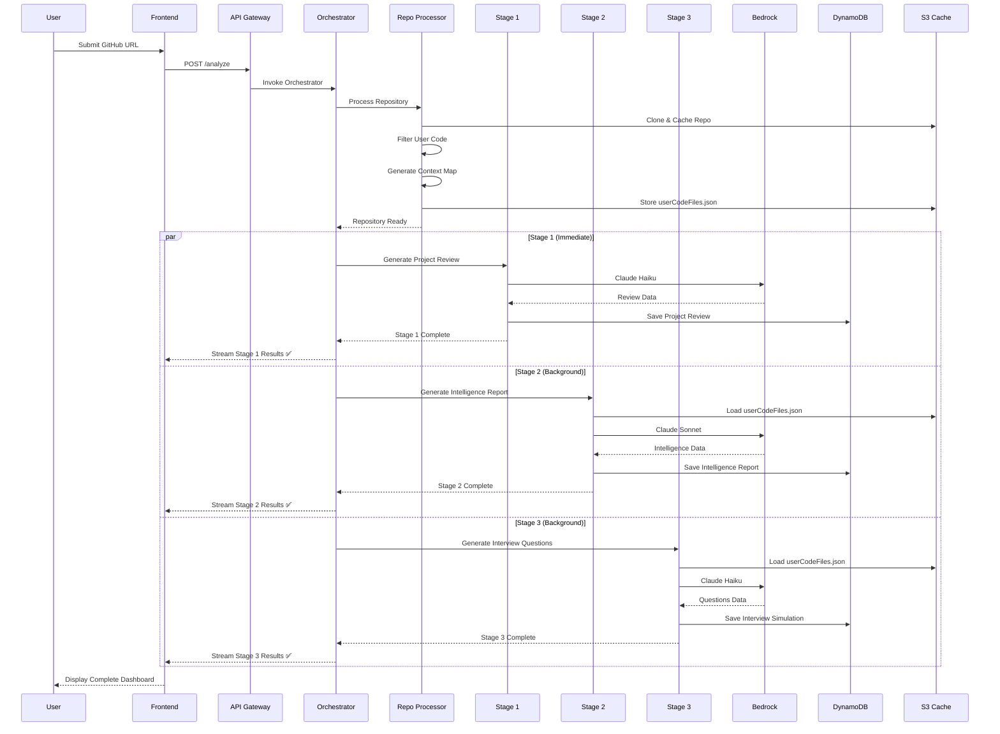

# System Design Document - DevContext.AI

## Document Information

**Version**: 2.0  
**Date**: March 2, 2026  
**Status**: Production  
**Last Updated**: March 2, 2026  
**Previous Version**: 1.0 (Commit: 19329e9184de899aa5387f48b3d0fe7f08af5e32)

---

## Table of Contents

1. [Introduction](#introduction)
2. [System Overview](#system-overview)
3. [Architecture](#architecture)
4. [Component Design](#component-design)
5. [Data Models](#data-models)
6. [AI Pipeline Design](#ai-pipeline-design)
7. [API Design](#api-design)
8. [Frontend Design](#frontend-design)
9. [Security Architecture](#security-architecture)
10. [Performance & Scalability](#performance--scalability)
11. [Cost Optimization](#cost-optimization)
12. [Deployment Architecture](#deployment-architecture)
13. [Monitoring & Observability](#monitoring--observability)
14. [Correctness Properties](#correctness-properties)
15. [Implementation Status](#implementation-status)
16. [Future Enhancements](#future-enhancements)

---

## 1. Introduction

### 1.1 Purpose

DevContext.AI is an AI-powered platform that transforms GitHub repositories into recruiter-ready project intelligence reports. The system addresses a critical gap for engineering graduates in India who build projects but struggle to articulate their architectural thinking and engineering decisions in interviews.

### 1.2 Scope

This document describes the complete system design including:
- Multi-stage AI analysis pipeline
- Progressive result streaming architecture
- Real-time interview simulation
- Cost-optimized multi-model AI strategy
- Production deployment configuration

### 1.3 Target Audience

- Engineering students preparing for placements (India-focused)
- Early-career developers building portfolios
- Recruiters evaluating candidate projects


### 1.4 Key Design Principles

1. **Progressive Delivery**: Stage 1 results delivered within 30 seconds, remaining stages process in background
2. **Grounded Analysis**: All architectural claims reference specific files and line numbers
3. **User Code Focus**: Distinguish user-written code from library/framework code
4. **Cost Efficiency**: Multi-model strategy and intelligent token management
5. **Honest Feedback**: Direct, actionable insights without false encouragement
6. **Self-Correction**: Automatic detection and fixing of invalid AI-generated content

---

## 2. System Overview

### 2.1 High-Level Architecture

```
┌─────────────────────────────────────────────────────────────────┐
│                         USER LAYER                              │
│  ┌──────────────┐  ┌──────────────┐  ┌──────────────┐         │
│  │   Browser    │  │   Mobile     │  │   API        │         │
│  │   (React)    │  │   (Future)   │  │   Clients    │         │
│  └──────┬───────┘  └──────┬───────┘  └──────┬───────┘         │
└─────────┼──────────────────┼──────────────────┼────────────────┘
          │                  │                  │
          └──────────────────┴──────────────────┘
                             │
┌────────────────────────────┼────────────────────────────────────┐
│                    API GATEWAY LAYER                            │
│  ┌──────────────────────────────────────────────────────────┐  │
│  │  AWS API Gateway (REST + WebSocket)                      │  │
│  │  - CORS Configuration                                    │  │
│  │  - Rate Limiting (10 analyses/user/day)                  │  │
│  │  - Request Validation                                    │  │
│  │  - JWT Authentication                                    │  │
│  └──────────────────────────────────────────────────────────┘  │
└────────────────────────────┬────────────────────────────────────┘
                             │
┌────────────────────────────┼────────────────────────────────────┐
│                   AUTHENTICATION LAYER                          │
│  ┌──────────────────────────────────────────────────────────┐  │
│  │  AWS Cognito                                             │  │
│  │  - User Pool: ap-southeast-1_QVTlLVXey                   │  │
│  │  - Email Verification                                    │  │
│  │  - OAuth Integration (GitHub)                            │  │
│  │  - JWT Token Management                                  │  │
│  └──────────────────────────────────────────────────────────┘  │
└────────────────────────────┬────────────────────────────────────┘
                             │
┌────────────────────────────┬────────────────────────────────────┐
│                   ORCHESTRATION LAYER                           │
│  ┌──────────────────────────────────────────────────────────┐  │
│  │  Analysis Orchestrator Lambda                            │  │
│  │  - 25+ API Endpoints                                     │  │
│  │  - Workflow State Management                             │  │
│  │  - Progressive Result Streaming                          │  │
│  │  - Stage Coordination                                    │  │
│  │  - Cost Tracking Integration                             │  │
│  └──────────────────────────────────────────────────────────┘  │
└────────────────────────────┬────────────────────────────────────┘
                             │
          ┌──────────────────┼──────────────────┐
          │                  │                  │
┌─────────▼─────────┐ ┌──────▼──────┐ ┌────────▼────────┐
│  PROCESSING       │ │  AI STAGES  │ │  EVALUATION     │
│  LAYER            │ │  LAYER      │ │  LAYER          │
│                   │ │             │ │                 │
│ ┌───────────────┐ │ │ ┌─────────┐ │ │ ┌─────────────┐ │
│ │ Repository    │ │ │ │ Stage 1 │ │ │ │ Answer      │ │
│ │ Processor     │ │ │ │ Review  │ │ │ │ Evaluation  │ │
│ └───────────────┘ │ │ └─────────┘ │ │ └─────────────┘ │
│ ┌───────────────┐ │ │ ┌─────────┐ │ │                 │
│ │ Token Budget  │ │ │ │ Stage 2 │ │ │                 │
│ │ Manager       │ │ │ │ Intel   │ │ │                 │
│ └───────────────┘ │ │ └─────────┘ │ │                 │
│ ┌───────────────┐ │ │ ┌─────────┐ │ │                 │
│ │ Exclusion     │ │ │ │ Stage 3 │ │ │                 │
│ │ Filter        │ │ │ │ Q&A     │ │ │                 │
│ └───────────────┘ │ │ └─────────┘ │ │                 │
└───────────────────┘ └──────┬──────┘ └─────────────────┘
                             │
          ┌──────────────────┼──────────────────┐
          │                  │                  │
┌─────────▼─────────┐ ┌──────▼──────┐ ┌────────▼────────┐
│  VALIDATION       │ │  AI ENGINE  │ │  STORAGE        │
│  LAYER            │ │  LAYER      │ │  LAYER          │
│                   │ │             │ │                 │
│ ┌───────────────┐ │ │ ┌─────────┐ │ │ ┌─────────────┐ │
│ │ Grounding     │ │ │ │ Amazon  │ │ │ │ DynamoDB    │ │
│ │ Checker       │ │ │ │ Bedrock │ │ │ │ Main Table  │ │
│ └───────────────┘ │ │ └────┬────┘ │ │ └─────────────┘ │
│ ┌───────────────┐ │ │      │     │ │ ┌─────────────┐ │
│ │ Self-         │ │ │ ┌────▼────┐ │ │ │ S3 Cache    │ │
│ │ Correction    │ │ │ │ Claude  │ │ │ │ Bucket      │ │
│ │ Loop          │ │ │ │ Sonnet  │ │ │ └─────────────┘ │
│ └───────────────┘ │ │ └─────────┘ │ │                 │
│                   │ │ ┌─────────┐ │ │                 │
│                   │ │ │ Claude  │ │ │                 │
│                   │ │ │ Haiku   │ │ │                 │
│                   │ │ └─────────┘ │ │                 │
└───────────────────┘ └─────────────┘ └─────────────────┘
```

### 2.2 Technology Stack

**Frontend**:
- React 19.0.0
- TypeScript 5.0
- Tailwind CSS 3.4
- AWS Amplify (Authentication)
- Recharts (Data Visualization)

**Backend**:
- AWS Lambda (Node.js 20)
- TypeScript 5.0
- AWS SAM (Infrastructure as Code)
- Amazon Bedrock (Claude 3.5 Sonnet & Haiku)

**Storage**:
- DynamoDB (On-demand)
- S3 (Repository caching)

**Authentication**:
- AWS Cognito

**Monitoring**:
- CloudWatch Logs
- CloudWatch Metrics
- Cost Tracking (Custom)

### 2.3 Deployment Configuration

**Region**: ap-southeast-1 (Singapore)  
**API Endpoint**: `https://2jhc5i9ex2.execute-api.ap-southeast-1.amazonaws.com/prod`  
**Environment**: Production

---

## 3. Architecture

### 3.1 Architectural Style

DevContext.AI follows a **serverless microservices architecture** with the following characteristics:

1. **Event-Driven**: Lambda functions triggered by API Gateway events
2. **Stateless**: No server-side session state (JWT tokens for auth)
3. **Asynchronous**: Background processing for Stages 2 & 3
4. **Progressive**: Results streamed as they complete
5. **Cost-Optimized**: Pay-per-execution, auto-scaling

### 3.2 Component Interaction Diagram


```mermaid
sequenceDiagram
    participant U as User
    participant F as Frontend
    participant AG as API Gateway
    participant O as Orchestrator
    participant RP as Repo Processor
    participant S1 as Stage 1
    participant S2 as Stage 2
    participant S3 as Stage 3
    participant B as Bedrock
    participant D as DynamoDB
    participant S as S3 Cache

    U->>F: Submit GitHub URL
    F->>AG: POST /analyze
    AG->>O: Invoke Orchestrator
    
    O->>RP: Process Repository
    RP->>S: Clone & Cache Repo
    RP->>RP: Filter User Code
    RP->>RP: Generate Context Map
    RP->>S: Store userCodeFiles.json
    RP-->>O: Repository Ready
    
    par Stage 1 (Immediate)
        O->>S1: Generate Project Review
        S1->>B: Claude Haiku
        B-->>S1: Review Data
        S1->>D: Save Project Review
        S1-->>O: Stage 1 Complete
        O-->>F: Stream Stage 1 Results ✅
    and Stage 2 (Background)
        O->>S2: Generate Intelligence Report
        S2->>S: Load userCodeFiles.json
        S2->>B: Claude Sonnet
        B-->>S2: Intelligence Data
        S2->>D: Save Intelligence Report
        S2-->>O: Stage 2 Complete
        O-->>F: Stream Stage 2 Results ✅
    and Stage 3 (Background)
        O->>S3: Generate Interview Questions
        S3->>S: Load userCodeFiles.json
        S3->>B: Claude Haiku
        B-->>S3: Questions Data
        S3->>D: Save Interview Simulation
        S3-->>O: Stage 3 Complete
        O-->>F: Stream Stage 3 Results ✅
    end
    
    F-->>U: Display Complete Dashboard
```


### 3.3 Data Flow Architecture

```
GitHub Repository
       │
       ▼
┌──────────────────┐
│ Repository       │
│ Processor        │
│ - Clone repo     │
│ - Filter files   │
│ - Extract        │
│   metadata       │
└────────┬─────────┘
         │
         ▼
┌──────────────────┐
│ S3 Cache         │
│ - Filtered code  │
│ - userCodeFiles  │
│ - metadata.json  │
│ TTL: 24 hours    │
└────────┬─────────┘
         │
         ├──────────────────┬──────────────────┐
         │                  │                  │
         ▼                  ▼                  ▼
┌────────────────┐ ┌────────────────┐ ┌────────────────┐
│ Stage 1        │ │ Stage 2        │ │ Stage 3        │
│ Project Review │ │ Intelligence   │ │ Interview Q&A  │
│                │ │ Report         │ │                │
│ Model: Haiku   │ │ Model: Sonnet  │ │ Model: Haiku   │
│ Time: ~30s     │ │ Time: ~60s     │ │ Time: ~45s     │
└────────┬───────┘ └────────┬───────┘ └────────┬───────┘
         │                  │                  │
         └──────────────────┴──────────────────┘
                            │
                            ▼
                   ┌────────────────┐
                   │ DynamoDB       │
                   │ - Metadata     │
                   │ - Reviews      │
                   │ - Reports      │
                   │ - Questions    │
                   │ TTL: 90 days   │
                   └────────────────┘
```

---

## 4. Component Design

### 4.1 Analysis Orchestrator

**Responsibility**: Central coordinator for the entire analysis pipeline

**Location**: `backend/src/orchestrator.ts`

**Key Functions**:
- Route handling (25+ endpoints)
- Workflow state management
- Progressive result streaming
- Stage coordination
- Cost tracking integration
- Error handling and retry logic

**API Endpoints**:

| Method | Endpoint | Description |
|--------|----------|-------------|
| POST | `/analyze` | Initiate repository analysis |
| GET | `/analysis/{id}` | Get complete analysis results |
| GET | `/analysis/{id}/status` | Poll analysis progress |
| POST | `/analysis/{id}/continue-stage2` | Trigger Stage 2 |
| POST | `/analysis/{id}/continue-stage3` | Trigger Stage 3 |
| POST | `/interview/{id}/answer` | Submit and evaluate answer |
| GET | `/analysis/history` | Get user's analysis history |
| DELETE | `/analysis/{id}` | Delete analysis |
| GET | `/cost/analysis/{id}` | Get analysis cost breakdown |
| GET | `/cost/realtime` | Get real-time cost metrics |

**Workflow States**:

```typescript
type WorkflowState =
  | 'initializing'
  | 'repo_processing'
  | 'stage1_in_progress'
  | 'stage1_complete_awaiting_approval'
  | 'stage2_in_progress'
  | 'stage2_complete'
  | 'stage3_in_progress'
  | 'stage3_complete'
  | 'completed'
  | 'failed';
```

**State Transitions**:

```
initializing
    │
    ▼
repo_processing
    │
    ▼
stage1_in_progress
    │
    ▼
stage1_complete_awaiting_approval
    │
    ├─(user continues)─▶ stage2_in_progress
    │                         │
    │                         ▼
    │                    stage2_complete
    │                         │
    │                         ├─(user continues)─▶ stage3_in_progress
    │                         │                         │
    │                         │                         ▼
    │                         │                    stage3_complete
    │                         │                         │
    │                         └─────────────────────────┘
    │                                                   │
    └───────────────────────────────────────────────────┘
                                                        │
                                                        ▼
                                                   completed
```


### 4.2 Repository Processor

**Responsibility**: Clone, filter, and prepare repositories for analysis

**Location**: `backend/src/repo-processor.ts`

**Processing Pipeline**:

```typescript
async function processRepository(repoUrl: string, analysisId: string): Promise<RepositoryMetadata> {
  // 1. Clone repository to temporary directory
  const tempDir = await cloneRepository(repoUrl);
  
  // 2. Apply Intelligent Exclusion Filter
  const filteredFiles = await filterUserCode(tempDir);
  
  // 3. Extract repository metadata
  const metadata = await extractMetadata(tempDir, filteredFiles);
  
  // 4. Generate Project Context Map
  const contextMap = await generateContextMap(filteredFiles, metadata);
  
  // 5. Calculate Project Authenticity Score
  const authenticityScore = await calculateAuthenticityScore(tempDir);
  
  // 6. Store in S3 cache
  await cacheRepository(analysisId, filteredFiles, contextMap);
  
  // 7. Store userCodeFiles separately in S3
  await storeUserCodeFiles(analysisId, contextMap.userCodeFiles);
  
  // 8. Cleanup temporary directory
  await cleanup(tempDir);
  
  return {
    ...metadata,
    contextMap,
    authenticityScore,
    userCodeFilesS3Key: `${analysisId}/userCodeFiles.json`
  };
}
```

**Intelligent Exclusion Filter**:

```typescript
const EXCLUDED_DIRECTORIES = [
  'node_modules',
  'dist',
  'build',
  '.git',
  'venv',
  '__pycache__',
  '.next',
  'out',
  'target',
  'bin',
  'obj',
  '.aws-sam'
];

const EXCLUDED_EXTENSIONS = [
  '.png', '.jpg', '.jpeg', '.gif', '.svg', '.ico',
  '.woff', '.woff2', '.ttf', '.eot',
  '.mp4', '.mp3', '.wav',
  '.zip', '.tar', '.gz',
  '.exe', '.dll', '.so', '.dylib',
  '.lock', '.log'
];

const EXCLUDED_PATTERNS = [
  /\.min\.js$/,
  /\.bundle\.js$/,
  /\.map$/,
  /package-lock\.json$/,
  /yarn\.lock$/,
  /\.env$/,
  /\.pem$/,
  /id_rsa$/
];
```

**Project Context Map Generation**:

```typescript
interface ProjectContextMap {
  entryPoints: string[];           // main.py, index.js, App.tsx
  coreModules: string[];           // Business logic files
  utilityFiles: string[];          // Helper functions
  configFiles: string[];           // Configuration
  testFiles: string[];             // Test files
  frameworks: string[];            // Detected frameworks
  languages: Record<string, number>; // Language distribution
  userCodeFiles: string[];         // All user-written files
  totalFiles: number;
  totalLines: number;
}
```

**Project Authenticity Score**:

```typescript
function calculateAuthenticityScore(commitHistory: GitCommit[]): number {
  const factors = {
    commitCount: Math.min(commitHistory.length / 10, 1) * 30,
    commitSpread: calculateCommitSpread(commitHistory) * 25,
    commitMessages: evaluateCommitMessages(commitHistory) * 20,
    authorDiversity: calculateAuthorDiversity(commitHistory) * 15,
    incrementalChanges: detectIncrementalChanges(commitHistory) * 10
  };
  
  return Math.round(Object.values(factors).reduce((a, b) => a + b, 0));
}
```

### 4.3 Token Budget Manager

**Responsibility**: Manage AI token usage within 50,000 token limit

**Location**: `backend/src/token-budget-manager.ts`

**Token Allocation Strategy**:

```typescript
const TOKEN_BUDGET = {
  structure: 5000,      // File tree, metadata
  userCode: 35000,      // Actual code content
  context: 10000        // Framework patterns, comments
};

const PRIORITY_TIERS = {
  tier1: ['main.py', 'index.js', 'App.tsx', 'server.js'],  // Entry points
  tier2: ['controllers/', 'models/', 'services/'],          // Core logic
  tier3: ['utils/', 'helpers/', 'lib/'],                    // Utilities
  tier4: ['config/', 'constants/']                          // Configuration
};
```

**Token Estimation**:

```typescript
function estimateTokenCount(text: string): number {
  // Rough estimation: 1 token ≈ 4 characters
  return Math.ceil(text.length / 4);
}
```

**Intelligent Truncation**:

```typescript
async function truncateToTokenBudget(
  files: FileContent[],
  maxTokens: number
): Promise<FileContent[]> {
  const prioritized = prioritizeFiles(files);
  const truncated: FileContent[] = [];
  let currentTokens = 0;
  
  for (const file of prioritized) {
    const fileTokens = estimateTokenCount(file.content);
    
    if (currentTokens + fileTokens <= maxTokens) {
      truncated.push(file);
      currentTokens += fileTokens;
    } else {
      // Partial inclusion for important files
      if (file.priority === 'tier1' || file.priority === 'tier2') {
        const remainingTokens = maxTokens - currentTokens;
        const partialContent = file.content.substring(0, remainingTokens * 4);
        truncated.push({
          ...file,
          content: partialContent + '\n... (truncated)'
        });
      }
      break;
    }
  }
  
  return truncated;
}
```


### 4.4 Stage 1: Project Review Generator

**Responsibility**: Generate code quality assessment and employability score

**Location**: `backend/src/stage1-review.ts`

**Model**: Claude 3.5 Haiku (Fast, cost-effective for structured analysis)

**Prompt Structure**:

```typescript
const stage1Prompt = `You are a Senior Engineering Manager at a top tech company reviewing a candidate's project for hiring.

PROJECT CONTEXT:
Repository: ${repositoryName}
Languages: ${JSON.stringify(languages)}
Frameworks: ${frameworks.join(', ')}
Total Files: ${totalFiles}
Total Lines: ${totalLines}

CODE SAMPLE:
${codeContext}

TASK: Provide a comprehensive project review covering:

1. CODE QUALITY (0-100):
   - Readability: Clear naming, formatting, comments
   - Maintainability: Modularity, DRY principle, separation of concerns
   - Best Practices: Error handling, input validation, security

2. ARCHITECTURE CLARITY (0-100):
   - Component organization
   - Separation of concerns
   - Design patterns usage

3. EMPLOYABILITY SIGNAL (0-100):
   - Production readiness
   - Complexity appropriate for level
   - Demonstrates engineering thinking

4. PROJECT AUTHENTICITY (0-100):
   - Commit history analysis
   - Incremental development evidence
   - Original work vs tutorial code

5. IMPROVEMENT AREAS:
   - 3-5 specific, actionable suggestions
   - Reference specific files and line numbers

6. STRENGTHS:
   - 3-5 positive patterns worth highlighting

Return ONLY valid JSON matching this schema:
{
  "codeQuality": { "overall": number, "readability": number, "maintainability": number, "bestPractices": number },
  "architectureClarity": { "overall": number, "componentOrganization": number, "separationOfConcerns": number },
  "employabilitySignal": { "overall": number, "productionReadiness": number, "complexity": number },
  "projectAuthenticity": { "overall": number, "commitDiversity": number, "incrementalDevelopment": number },
  "improvementAreas": [{ "area": string, "description": string, "fileReferences": string[] }],
  "strengths": [{ "pattern": string, "description": string, "fileReferences": string[] }]
}`;
```

**Output Schema**:

```typescript
interface ProjectReview {
  codeQuality: {
    overall: number;
    readability: number;
    maintainability: number;
    bestPractices: number;
    details: string;
  };
  architectureClarity: {
    overall: number;
    componentOrganization: number;
    separationOfConcerns: number;
    details: string;
  };
  employabilitySignal: {
    overall: number;
    productionReadiness: number;
    complexity: number;
    marketRelevance: number;
    details: string;
  };
  projectAuthenticity: {
    overall: number;
    commitDiversity: number;
    incrementalDevelopment: number;
    details: string;
  };
  improvementAreas: Array<{
    area: string;
    description: string;
    priority: 'high' | 'medium' | 'low';
    fileReferences: string[];
  }>;
  strengths: Array<{
    pattern: string;
    description: string;
    fileReferences: string[];
  }>;
  generatedAt: string;
}
```

### 4.5 Stage 2: Intelligence Report Generator

**Responsibility**: Reconstruct architecture and design decisions

**Location**: `backend/src/stage2-intelligence.ts`

**Model**: Claude 3.5 Sonnet (Deep reasoning for architecture)

**Key Features**:
- Chain-of-Thought prompting for architectural reasoning
- Grounding validation for all claims
- S3-based userCodeFiles loading
- Conditional grounding checks

**Critical Fix Applied** (March 2, 2026):

```typescript
// BEFORE (Caused crashes):
const validation = groundingChecker.validateIntelligenceReport(
  intelligenceReport,
  projectContextMap.userCodeFiles  // ❌ undefined
);

// AFTER (Fixed):
// Load userCodeFiles from S3
let userCodeFiles: string[] = [];
if (projectContextMap.userCodeFilesS3Key) {
  try {
    const s3Response = await s3Client.send(new GetObjectCommand({
      Bucket: CACHE_BUCKET,
      Key: projectContextMap.userCodeFilesS3Key
    }));
    const fileData = await s3Response.Body?.transformToString();
    userCodeFiles = JSON.parse(fileData || '[]');
    console.log(`✅ Loaded ${userCodeFiles.length} userCodeFiles from S3`);
  } catch (error) {
    console.warn('⚠️ Could not load userCodeFiles from S3:', error);
  }
}

// Conditional validation
if (userCodeFiles.length > 0) {
  const validation = groundingChecker.validateIntelligenceReport(
    intelligenceReport,
    userCodeFiles
  );
  // ... validation logic
} else {
  console.warn('⚠️ Skipping grounding validation - no userCodeFiles available');
}
```

**Prompt Structure**:

```typescript
const stage2Prompt = `You are a Staff Engineer at Google conducting a technical deep-dive on a candidate's project.

PROJECT CONTEXT:
${projectContext}

USER CODE FILES (reference these only):
${userCodeFilesList}

CODE SAMPLE:
${codeContext}

TASK: Reconstruct the system architecture and design decisions.

1. SYSTEM ARCHITECTURE:
   - Component diagram (text-based)
   - Data flow description
   - Technology stack rationale

2. DESIGN DECISIONS (5-7):
   - What decision was made?
   - Why was it made? (infer from code)
   - What alternatives were considered?
   - Trade-offs accepted
   - File references (REQUIRED)

3. TECHNICAL TRADE-OFFS:
   - Performance vs Maintainability
   - Consistency vs Availability
   - Complexity vs Simplicity

4. SCALABILITY ANALYSIS:
   - Current bottlenecks
   - Growth limitations
   - Optimization opportunities

5. RESUME BULLETS (5-7):
   - Professional, action-oriented
   - Quantify where possible
   - Highlight technical depth

CRITICAL RULES:
- Every claim MUST reference specific files
- If you cannot find evidence, output "Insufficient Evidence"
- Do NOT invent rationale without code evidence
- Distinguish user code from framework patterns

Return ONLY valid JSON.`;
```


### 4.6 Stage 3: Interview Simulation Generator

**Responsibility**: Generate project-specific interview questions

**Location**: `backend/src/stage3-questions.ts`

**Model**: Claude 3.5 Haiku (Efficient question generation)

**Key Features**:
- Self-correction loop (max 3 iterations)
- Robust JSON parsing with control character removal
- S3-based userCodeFiles loading
- Grounding validation

**Critical Fixes Applied** (March 2, 2026):

**Fix 1: UserCodeFiles Loading**
```typescript
// Load userCodeFiles from S3 (same as Stage 2)
let userCodeFiles: string[] = [];
if (projectContextMap.userCodeFilesS3Key) {
  const s3Response = await s3Client.send(new GetObjectCommand({
    Bucket: CACHE_BUCKET,
    Key: projectContextMap.userCodeFilesS3Key
  }));
  const fileData = await s3Response.Body?.transformToString();
  userCodeFiles = JSON.parse(fileData || '[]');
}
```

**Fix 2: Robust JSON Parsing**
```typescript
function parseQuestionsFromResponse(content: string): any[] {
  const jsonMatch = content.match(/\[[\s\S]*\]/);
  if (!jsonMatch) return [];
  
  let jsonText = jsonMatch[0];
  
  // CRITICAL: Clean control characters FIRST
  console.log('🧹 Cleaning control characters from JSON...');
  jsonText = jsonText
    // Remove ALL control characters (0x00-0x1F, 0x7F)
    .replace(/[\x00-\x1F\x7F]/g, ' ')
    // Handle escaped versions
    .replace(/\\n/g, ' ')
    .replace(/\\r/g, '')
    .replace(/\\t/g, ' ')
    .replace(/\\f/g, ' ')
    .replace(/\\b/g, ' ')
    // Remove trailing commas
    .replace(/,(\s*[}\]])/g, '$1')
    // Remove comments
    .replace(/\/\/.*/g, '')
    .replace(/\/\*[\s\S]*?\*\//g, '')
    // Fix multiple commas
    .replace(/,+/g, ',')
    // Fix missing commas between objects
    .replace(/\}\s*\{/g, '},{')
    .trim();
  
  // Strategy 1: Try direct parse after cleaning
  try {
    const parsed = JSON.parse(jsonText);
    console.log('✅ Parsed after control char cleanup');
    return Array.isArray(parsed) ? parsed : [];
  } catch (e) {
    console.warn('⚠️ Parse failed, trying truncation...');
  }
  
  // Strategy 2: Find valid JSON portion by bracket matching
  let bracketCount = 0;
  let lastValidIndex = 0;
  
  for (let i = 0; i < jsonText.length; i++) {
    if (jsonText[i] === '[') bracketCount++;
    if (jsonText[i] === ']') {
      bracketCount--;
      if (bracketCount === 0) {
        lastValidIndex = i + 1;
        break;
      }
    }
  }
  
  if (lastValidIndex > 0) {
    try {
      const parsed = JSON.parse(jsonText.substring(0, lastValidIndex));
      console.log(`✅ Parsed truncated JSON (${lastValidIndex} chars)`);
      return Array.isArray(parsed) ? parsed : [];
    } catch (e) {
      console.warn('⚠️ Truncation failed, extracting objects...');
    }
  }
  
  // Strategy 3: Extract individual question objects
  const regex = /\{[^{}]*?"questionId"\s*:\s*"[^"]*"[^{}]*?"question"\s*:\s*"[^"]*"[^{}]*?"category"\s*:\s*"[^"]*"[^{}]*?\}/gs;
  const matches = Array.from(content.matchAll(regex));
  
  const extracted: any[] = [];
  for (const match of matches) {
    try {
      let objText = match[0]
        .replace(/[\x00-\x1F\x7F]/g, ' ')
        .replace(/\\n/g, ' ')
        .replace(/,(\s*})/g, '$1');
      
      const q = JSON.parse(objText);
      if (q.questionId && q.question && q.category) {
        extracted.push(q);
      }
    } catch (e) {
      // Skip malformed
    }
  }
  
  if (extracted.length >= 10) {
    console.log(`✅ Extracted ${extracted.length} valid questions`);
    return extracted;
  }
  
  console.error(`❌ Failed to extract enough questions. Only got ${extracted.length}`);
  return extracted;
}
```

**Question Generation Prompt**:

```typescript
const stage3Prompt = `You are a Staff Engineer at Google preparing a technical interview question bank.

PROJECT CONTEXT:
Frameworks: ${contextMap.frameworks.join(', ')}
Entry Points: ${contextMap.entryPoints.join(', ')}
Languages: ${JSON.stringify(contextMap.languages)}

USER CODE FILES (reference these only):
${userCodeFilesList}

CODE SAMPLE:
${codeContext}

TASK: Generate 50 interview questions.

DISTRIBUTION:
- Architecture (12): System design, component interactions
- Implementation (12): Code decisions, algorithms
- Trade-offs (10): Why X over Y
- Scalability (8): Bottlenecks, optimization
- Design Patterns (4): Patterns used
- Security (4): Auth, validation

DIFFICULTY:
- Junior-Mid (15)
- Mid-Level (20)
- Senior (12)
- Staff+ (3)

REQUIREMENTS:
1. Reference SPECIFIC files from the list above
2. Include line numbers when possible
3. Be answerable from provided code
4. Include evaluation criteria

FORMAT: Return ONLY a valid JSON array with this structure:
[
  {
    "questionId": "Q001",
    "question": "In your routes/api.js (lines 23-45), why did you choose 100 req/min for rate limiting?",
    "category": "implementation",
    "difficulty": "mid-level",
    "estimatedTime": 5,
    "context": {
      "fileReferences": [{"file": "routes/api.js", "lineStart": 23, "lineEnd": 45}],
      "codeSnippet": "const limiter = rateLimit({ windowMs: 60000, max: 100 });",
      "relatedConcepts": ["rate limiting", "security"]
    },
    "expectedAnswer": {
      "keyPoints": ["Prevents DDoS", "Allows normal usage", "Returns 429"],
      "acceptableApproaches": ["Token bucket", "Sliding window"],
      "redFlags": ["No rate limiting needed"],
      "idealAnswerLength": "2-3 minutes"
    },
    "followUpQuestions": ["How would you handle different user tiers?"],
    "evaluationCriteria": {
      "technicalAccuracy": 0.3,
      "completeness": 0.3,
      "clarity": 0.2,
      "depthOfUnderstanding": 0.2
    },
    "tags": ["security", "performance"]
  }
]

Generate ALL 50 questions. Return ONLY valid JSON, no markdown, no explanation.`;
```

**Self-Correction Loop**:

```typescript
async function generateMasterQuestionBank(
  contextMap: ProjectContextMap,
  codeContext: string,
  analysisId: string
): Promise<any[]> {
  const groundingChecker = new GroundingChecker();
  const correctionLoop = new SelfCorrectionLoop(3, 75); // 3 attempts, 75% threshold

  const generator = async (feedback?: string): Promise<any[]> => {
    return await generateQuestions(contextMap, codeContext, feedback, analysisId);
  };

  const validator = async (questions: any[]): Promise<ValidationResult> => {
    const validation = groundingChecker.validateInterviewQuestions(
      questions,
      contextMap.userCodeFiles
    );

    const issues: string[] = [];
    
    if (validation.overallResult.confidence === 'insufficient') {
      issues.push(`Poor grounding: ${validation.invalidQuestions.length} invalid files`);
    }
    
    if (questions.length < 40) {
      issues.push(`Too few questions: ${questions.length} (expected 45-60)`);
    }

    const categories = questions.reduce((acc, q) => {
      acc[q.category] = (acc[q.category] || 0) + 1;
      return acc;
    }, {} as Record<string, number>);
    
    if (categories.architecture < 10) issues.push('Too few architecture questions');
    if (categories.implementation < 10) issues.push('Too few implementation questions');

    const groundingScore = validation.overallResult.confidence === 'high' ? 100 :
                          validation.overallResult.confidence === 'medium' ? 80 : 60;
    
    const countScore = Math.min(100, (questions.length / 50) * 100);
    const validQuestionRatio = validation.validQuestions.length / questions.length;
    const validityScore = validQuestionRatio * 100;

    const finalScore = Math.round((groundingScore * 0.4) + (countScore * 0.3) + (validityScore * 0.3));

    return {
      isValid: issues.length === 0 && finalScore >= 75,
      score: finalScore,
      feedback: issues.length === 0 
        ? 'Comprehensive question bank with excellent grounding'
        : `Issues: ${issues.join('; ')}`,
      issues
    };
  };

  const result = await correctionLoop.correctWithRetry(generator, validator);

  console.log(`Question generation: ${result.totalAttempts} attempts, converged: ${result.converged}, final score: ${result.bestScore}`);

  return result.finalResult;
}
```


### 4.7 Grounding Checker

**Responsibility**: Validate that all AI-generated claims reference actual user code files

**Location**: `backend/src/grounding-checker.ts`

**Critical Fix Applied** (March 2, 2026):

```typescript
// BEFORE (Caused crashes):
const fileReferences = claim.fileReferences.map(ref => ref.file);

// AFTER (Type-safe):
const fileReferences = claim.fileReferences
  .filter(ref => ref && typeof ref === 'object' && typeof ref.file === 'string')
  .map(ref => ref.file);
```

**Validation Logic**:

```typescript
class GroundingChecker {
  validateIntelligenceReport(
    report: IntelligenceReport,
    userCodeFiles: string[]
  ): ValidationResult {
    const validClaims: any[] = [];
    const invalidClaims: any[] = [];
    
    for (const decision of report.designDecisions) {
      const fileRefs = decision.fileReferences
        .filter(ref => typeof ref === 'string' || (ref && typeof ref.file === 'string'))
        .map(ref => typeof ref === 'string' ? ref : ref.file);
      
      const allValid = fileRefs.every(file => 
        userCodeFiles.some(userFile => userFile.includes(file))
      );
      
      if (allValid && fileRefs.length > 0) {
        validClaims.push(decision);
      } else {
        invalidClaims.push(decision);
      }
    }
    
    const confidence = this.calculateConfidence(validClaims.length, invalidClaims.length);
    
    return {
      validClaims,
      invalidClaims,
      confidence,
      invalidReferences: this.extractInvalidReferences(invalidClaims, userCodeFiles)
    };
  }
  
  private calculateConfidence(valid: number, invalid: number): 'high' | 'medium' | 'low' | 'insufficient' {
    const total = valid + invalid;
    if (total === 0) return 'insufficient';
    
    const ratio = valid / total;
    if (ratio >= 0.9) return 'high';
    if (ratio >= 0.7) return 'medium';
    if (ratio >= 0.5) return 'low';
    return 'insufficient';
  }
}
```

### 4.8 Self-Correction Loop

**Responsibility**: Automatically regenerate invalid AI outputs

**Location**: `backend/src/self-correction.ts`

**Algorithm**:

```typescript
class SelfCorrectionLoop {
  constructor(
    private maxAttempts: number = 3,
    private qualityThreshold: number = 75
  ) {}
  
  async correctWithRetry<T>(
    generator: (feedback?: string) => Promise<T>,
    validator: (result: T) => Promise<ValidationResult>
  ): Promise<CorrectionResult<T>> {
    let bestResult: T | null = null;
    let bestScore = 0;
    let feedback: string | undefined;
    
    for (let attempt = 1; attempt <= this.maxAttempts; attempt++) {
      console.log(`Self-correction attempt ${attempt}/${this.maxAttempts}`);
      
      // Generate with feedback from previous attempt
      const result = await generator(feedback);
      
      // Validate
      const validation = await validator(result);
      
      // Track best result
      if (validation.score > bestScore) {
        bestScore = validation.score;
        bestResult = result;
      }
      
      // Check if quality threshold met
      if (validation.isValid && validation.score >= this.qualityThreshold) {
        return {
          finalResult: result,
          converged: true,
          totalAttempts: attempt,
          bestScore: validation.score
        };
      }
      
      // Prepare feedback for next attempt
      feedback = validation.feedback;
    }
    
    // Return best result even if not converged
    return {
      finalResult: bestResult!,
      converged: false,
      totalAttempts: this.maxAttempts,
      bestScore
    };
  }
}
```

### 4.9 Answer Evaluation

**Responsibility**: Evaluate user answers to interview questions

**Location**: `backend/src/answer-eval.ts`

**Model**: Claude 3.5 Sonnet (Nuanced feedback)

**Evaluation Criteria**:

```typescript
interface EvaluationCriteria {
  technicalAccuracy: number;    // 0.3 weight
  completeness: number;          // 0.3 weight
  clarity: number;               // 0.2 weight
  depthOfUnderstanding: number;  // 0.2 weight
}

interface AnswerEvaluation {
  overallScore: number;          // 0-100
  criteriaScores: EvaluationCriteria;
  strengths: string[];
  weaknesses: string[];
  missingPoints: string[];
  exampleAnswer: string;
  improvementSuggestions: string[];
  keyTermsMissed: string[];
}
```

**Prompt Structure**:

```typescript
const evaluationPrompt = `You are an experienced technical interviewer evaluating a candidate's answer.

QUESTION:
${question.question}

EXPECTED ANSWER KEY POINTS:
${question.expectedAnswer.keyPoints.join('\n')}

CANDIDATE'S ANSWER:
${userAnswer}

TASK: Evaluate the answer on these criteria:

1. TECHNICAL ACCURACY (30%):
   - Factually correct?
   - Demonstrates understanding?

2. COMPLETENESS (30%):
   - Covers key points?
   - Addresses all aspects?

3. CLARITY (20%):
   - Well-structured?
   - Easy to follow?

4. DEPTH OF UNDERSTANDING (20%):
   - Goes beyond surface level?
   - Shows engineering thinking?

Provide:
- Overall score (0-100)
- Criteria breakdown
- Strengths (what they did well)
- Weaknesses (what needs improvement)
- Missing points (key concepts not mentioned)
- Example answer (for comparison)
- Improvement suggestions

Return ONLY valid JSON.`;
```

### 4.10 Cost Tracker

**Responsibility**: Track and report AI usage costs

**Location**: `backend/src/cost-tracker.ts`

**Cost Tracking**:

```typescript
interface BedrockCallMetrics {
  analysisId: string;
  stage: string;
  modelId: string;
  inputTokens: number;
  outputTokens: number;
  inferenceTimeMs: number;
  promptLength: number;
  responseLength: number;
  timestamp: string;
}

async function trackBedrockCall(metrics: BedrockCallMetrics): Promise<void> {
  const cost = calculateCost(metrics.modelId, metrics.inputTokens, metrics.outputTokens);
  
  await dynamodb.put({
    TableName: TABLE_NAME,
    Item: {
      PK: `ANALYSIS#${metrics.analysisId}`,
      SK: `COST#${Date.now()}`,
      ...metrics,
      estimatedCost: cost,
      ttl: Math.floor(Date.now() / 1000) + (90 * 24 * 60 * 60)
    }
  });
}

function calculateCost(modelId: string, inputTokens: number, outputTokens: number): number {
  const pricing = {
    'us.anthropic.claude-3-5-sonnet-20241022-v2:0': {
      input: 3.00 / 1_000_000,   // $3 per 1M tokens
      output: 15.00 / 1_000_000  // $15 per 1M tokens
    },
    'us.anthropic.claude-3-5-haiku-20241022-v1:0': {
      input: 0.80 / 1_000_000,   // $0.80 per 1M tokens
      output: 4.00 / 1_000_000   // $4 per 1M tokens
    }
  };
  
  const model = pricing[modelId] || pricing['us.anthropic.claude-3-5-haiku-20241022-v1:0'];
  return (inputTokens * model.input) + (outputTokens * model.output);
}
```

---

## 5. Data Models

### 5.1 DynamoDB Schema

**Table Name**: `DevContextMain`

**Primary Key**: 
- `PK` (String) - Partition Key
- `SK` (String) - Sort Key

**Access Patterns**:

| Pattern | PK | SK | GSI |
|---------|----|----|-----|
| Get analysis metadata | `ANALYSIS#<id>` | `METADATA` | - |
| Get project review | `ANALYSIS#<id>` | `PROJECT_REVIEW` | - |
| Get intelligence report | `ANALYSIS#<id>` | `INTELLIGENCE_REPORT` | - |
| Get interview simulation | `ANALYSIS#<id>` | `INTERVIEW_SIMULATION` | - |
| Get user analyses | - | - | `userId-createdAt-index` |
| Get cost data | `ANALYSIS#<id>` | `COST#<timestamp>` | - |

**Item Structure**:

```typescript
// Metadata Item
{
  PK: "ANALYSIS#bf3aadf7-d193-4d1d-b711-d17d8964fe34",
  SK: "METADATA",
  analysisId: "bf3aadf7-d193-4d1d-b711-d17d8964fe34",
  userId: "user-123",
  repositoryUrl: "https://github.com/user/repo",
  repositoryName: "repo",
  status: "completed",
  workflowState: "completed",
  createdAt: "2026-03-02T10:00:00Z",
  updatedAt: "2026-03-02T10:05:00Z",
  completedStages: ["project_review", "intelligence_report", "interview_simulation"],
  ttl: 1743523200  // 90 days from creation
}

// Project Review Item
{
  PK: "ANALYSIS#bf3aadf7-d193-4d1d-b711-d17d8964fe34",
  SK: "PROJECT_REVIEW",
  codeQuality: { ... },
  architectureClarity: { ... },
  employabilitySignal: { ... },
  improvementAreas: [ ... ],
  strengths: [ ... ],
  generatedAt: "2026-03-02T10:01:00Z",
  ttl: 1743523200
}

// Intelligence Report Item
{
  PK: "ANALYSIS#bf3aadf7-d193-4d1d-b711-d17d8964fe34",
  SK: "INTELLIGENCE_REPORT",
  systemArchitecture: { ... },
  designDecisions: [ ... ],
  technicalTradeoffs: [ ... },
  scalabilityAnalysis: { ... },
  resumeBullets: [ ... ],
  generatedAt: "2026-03-02T10:03:00Z",
  ttl: 1743523200
}

// Interview Simulation Item
{
  PK: "ANALYSIS#bf3aadf7-d193-4d1d-b711-d17d8964fe34",
  SK: "INTERVIEW_SIMULATION",
  masterQuestionBank: {
    totalQuestions: 50,
    questions: [ ... ],
    categoryCounts: { ... },
    difficultyDistribution: { ... }
  },
  interviewTracks: {
    track1_quickAssessment: { ... },
    track2_standardInterview: { ... },
    track3_deepDive: { ... }
  },
  generatedAt: "2026-03-02T10:05:00Z",
  ttl: 1743523200
}

// Cost Tracking Item
{
  PK: "ANALYSIS#bf3aadf7-d193-4d1d-b711-d17d8964fe34",
  SK: "COST#1709377200000",
  stage: "intelligence_report",
  modelId: "us.anthropic.claude-3-5-sonnet-20241022-v2:0",
  inputTokens: 25000,
  outputTokens: 5000,
  estimatedCost: 0.15,
  inferenceTimeMs: 15000,
  timestamp: "2026-03-02T10:03:00Z",
  ttl: 1743523200
}
```

### 5.2 S3 Bucket Structure

**Bucket Name**: `devcontext-repo-cache-ap-southeast-1`

**Structure**:

```
devcontext-repo-cache-ap-southeast-1/
├── <analysisId>/
│   ├── filtered_code/
│   │   ├── src/
│   │   │   ├── index.js
│   │   │   ├── controllers/
│   │   │   └── models/
│   │   ├── package.json
│   │   └── README.md
│   ├── metadata.json
│   └── userCodeFiles.json  ← NEW: Separate file for userCodeFiles array
└── ...
```

**Lifecycle Policy**: Delete after 24 hours

**userCodeFiles.json Format**:

```json
[
  "src/index.js",
  "src/controllers/userController.js",
  "src/models/User.js",
  "src/services/authService.js",
  "package.json",
  "README.md"
]
```


---

## 6. AI Pipeline Design

### 6.1 Multi-Model Strategy

DevContext.AI uses a cost-optimized multi-model strategy:

| Task | Model | Rationale | Cost |
|------|-------|-----------|------|
| **Stage 1: Project Review** | Claude 3.5 Haiku | Structured output, fast response, clear criteria | $0.80/M input, $4/M output |
| **Stage 2: Intelligence Report** | Claude 3.5 Sonnet | Complex architectural reasoning, deep inference | $3/M input, $15/M output |
| **Stage 3: Interview Questions** | Claude 3.5 Haiku | Pattern-based generation, structured format | $0.80/M input, $4/M output |
| **Answer Evaluation** | Claude 3.5 Sonnet | Nuanced feedback, criteria-based scoring | $3/M input, $15/M output |

**Cost Savings**: 27% reduction vs single-model approach

### 6.2 Chain-of-Thought Prompting

All AI stages use Chain-of-Thought prompting for better reasoning:

```
1. Analyze file structure → Identify patterns
2. Examine code samples → Extract decisions
3. Infer rationale → Validate with evidence
4. Generate output → Ground in specific files
```

### 6.3 Progressive Streaming Architecture

```
User Submits URL
       │
       ▼
┌──────────────────┐
│ Orchestrator     │
│ Creates Analysis │
└────────┬─────────┘
         │
         ▼
┌──────────────────┐
│ Repository       │
│ Processing       │
│ (~10 seconds)    │
└────────┬─────────┘
         │
         ├─────────────────────────────────┐
         │                                 │
         ▼                                 ▼
┌──────────────────┐              ┌──────────────────┐
│ Stage 1          │              │ Stages 2 & 3    │
│ (Immediate)      │              │ (Background)     │
│ ~30 seconds      │              │ ~90 seconds      │
└────────┬─────────┘              └────────┬─────────┘
         │                                 │
         ▼                                 ▼
┌──────────────────┐              ┌──────────────────┐
│ Stream to        │              │ Stream to        │
│ Frontend ✅      │              │ Frontend ✅      │
└──────────────────┘              └──────────────────┘
         │                                 │
         └─────────────┬───────────────────┘
                       ▼
              ┌──────────────────┐
              │ Complete         │
              │ Dashboard        │
              └──────────────────┘
```

**Benefits**:
- User sees results immediately (Stage 1 in 30s)
- No blocking wait for full analysis
- Better perceived performance
- Reduced user abandonment

---

## 7. API Design

### 7.1 REST API Endpoints

**Base URL**: `https://2jhc5i9ex2.execute-api.ap-southeast-1.amazonaws.com/prod`

**Authentication**: JWT tokens from AWS Cognito

#### Analysis Endpoints

```
POST /analyze
Request:
{
  "repositoryUrl": "https://github.com/user/repo",
  "targetRole": "Senior SDE" (optional)
}

Response:
{
  "analysisId": "bf3aadf7-d193-4d1d-b711-d17d8964fe34",
  "status": "processing",
  "workflowState": "initializing",
  "estimatedCompletionTime": 90
}
```

```
GET /analysis/{id}/status
Response:
{
  "analysisId": "bf3aadf7-d193-4d1d-b711-d17d8964fe34",
  "status": "processing",
  "workflowState": "stage1_complete_awaiting_approval",
  "stages": {
    "project_review": {
      "status": "completed",
      "completedAt": "2026-03-02T10:01:00Z"
    },
    "intelligence_report": {
      "status": "pending"
    },
    "interview_simulation": {
      "status": "pending"
    }
  },
  "progress": 33
}
```

```
GET /analysis/{id}
Response:
{
  "analysisId": "bf3aadf7-d193-4d1d-b711-d17d8964fe34",
  "repositoryUrl": "https://github.com/user/repo",
  "repositoryName": "repo",
  "status": "completed",
  "projectReview": { ... },
  "intelligenceReport": { ... },
  "interviewSimulation": { ... },
  "createdAt": "2026-03-02T10:00:00Z",
  "completedAt": "2026-03-02T10:05:00Z"
}
```

#### Interview Endpoints

```
POST /interview/{id}/answer
Request:
{
  "questionId": "Q001",
  "answer": "The rate limiting implementation uses..."
}

Response:
{
  "evaluation": {
    "overallScore": 85,
    "criteriaScores": {
      "technicalAccuracy": 90,
      "completeness": 85,
      "clarity": 80,
      "depthOfUnderstanding": 85
    },
    "strengths": ["Clear explanation", "Mentioned trade-offs"],
    "weaknesses": ["Didn't discuss alternatives"],
    "missingPoints": ["Token bucket algorithm"],
    "exampleAnswer": "...",
    "improvementSuggestions": ["..."]
  }
}
```

#### Cost Tracking Endpoints

```
GET /cost/analysis/{id}
Response:
{
  "analysisId": "bf3aadf7-d193-4d1d-b711-d17d8964fe34",
  "totalCost": 0.29,
  "breakdown": {
    "stage1": 0.05,
    "stage2": 0.15,
    "stage3": 0.09
  },
  "tokenUsage": {
    "totalInput": 45000,
    "totalOutput": 12000
  }
}
```

```
GET /cost/realtime
Response:
{
  "last24Hours": {
    "totalCost": 12.50,
    "analysisCount": 45,
    "avgCostPerAnalysis": 0.28
  },
  "last7Days": {
    "totalCost": 85.00,
    "analysisCount": 300,
    "avgCostPerAnalysis": 0.28
  }
}
```

### 7.2 Error Responses

```json
{
  "error": {
    "code": "REPOSITORY_NOT_FOUND",
    "message": "The specified repository could not be accessed",
    "details": "GitHub returned 404 Not Found"
  }
}
```

**Error Codes**:
- `REPOSITORY_NOT_FOUND` - Repository doesn't exist or is private
- `REPOSITORY_TOO_LARGE` - Exceeds 1GB or 500 files
- `INVALID_REPOSITORY_URL` - Malformed URL
- `RATE_LIMIT_EXCEEDED` - User exceeded 10 analyses/day
- `AUTHENTICATION_FAILED` - Invalid or expired JWT token
- `ANALYSIS_NOT_FOUND` - Analysis ID doesn't exist
- `UNAUTHORIZED_ACCESS` - User doesn't own this analysis
- `INTERNAL_ERROR` - Unexpected server error

---

## 8. Frontend Design

### 8.1 Component Architecture

```
App.tsx
├── AuthContext (Global auth state)
├── Routes
│   ├── / → LandingPage
│   ├── /login → LoginPage
│   ├── /signup → SignupPage
│   ├── /home → HomePage (authenticated)
│   ├── /loading/:id → LoadingPage
│   ├── /dashboard/:id → DashboardPage
│   ├── /account → AccountPage
│   ├── /settings → SettingsPage
│   └── /admin/cost → AdminCostDashboard
│
└── Protected Routes (require authentication)
```

### 8.2 Dashboard Layout

```
┌─────────────────────────────────────────────────────────┐
│  Sidebar                    │  Main Content             │
│                             │                           │
│  ┌─────────────────┐        │  ┌─────────────────────┐ │
│  │ Overview        │        │  │ Tab Navigation      │ │
│  │ History         │        │  │ ┌───┬───┬───┬───┐   │ │
│  │ Interview       │        │  │ │ 1 │ 2 │ 3 │ 4 │   │ │
│  │ Report          │        │  │ └───┴───┴───┴───┘   │ │
│  │ Review          │        │  │                     │ │
│  └─────────────────┘        │  │ Tab Content:        │ │
│                             │  │                     │ │
│  ┌─────────────────┐        │  │ - Overview Tab      │ │
│  │ Export          │        │  │ - History Tab       │ │
│  │ ┌─────────────┐ │        │  │ - Interview Tab     │ │
│  │ │ PDF         │ │        │  │ - Report Tab        │ │
│  │ │ Markdown    │ │        │  │ - Review Tab        │ │
│  │ │ JSON        │ │        │  │                     │ │
│  │ └─────────────┘ │        │  └─────────────────────┘ │
│  └─────────────────┘        │                           │
└─────────────────────────────────────────────────────────┘
```

### 8.3 Key Components

**DashboardPage.tsx**:
- Main container for analysis results
- Tab navigation (Overview, History, Interview, Report, Review)
- Real-time progress updates
- Export functionality

**LoadingPage.tsx**:
- Progress indicator
- Stage status display
- Estimated completion time
- Real-time updates via polling

**InterviewTab.tsx**:
- Question display
- Answer input
- Real-time evaluation
- Score visualization

**ReviewTab.tsx**:
- Code quality metrics
- Employability signal
- Improvement areas
- Strengths

**ReportTab.tsx**:
- Architecture diagrams
- Design decisions
- Resume bullets
- Scalability analysis

---

## 9. Security Architecture

### 9.1 Authentication Flow

```
User → Frontend → Cognito → JWT Token → API Gateway → Lambda
                     ↓
              User Pool Verification
                     ↓
              Token Validation
                     ↓
              User ID Extraction
```

### 9.2 Authorization

- All API requests require valid JWT token
- User ID extracted from token
- DynamoDB queries filtered by userId
- Cross-user access prevented

### 9.3 Data Protection

**At Rest**:
- DynamoDB encrypted with AWS KMS
- S3 encrypted with AWS KMS

**In Transit**:
- TLS 1.2+ for all API communications
- HTTPS only

**Data Retention**:
- Repository code: 24 hours (S3 lifecycle)
- Analysis results: 90 days (DynamoDB TTL)
- User can delete immediately

### 9.4 GitHub Token Handling

- OAuth tokens used once during analysis
- Never persisted to database
- Immediately discarded after use
- Read-only repository access

---

## 10. Performance & Scalability

### 10.1 Performance Targets

| Metric | Target | Actual |
|--------|--------|--------|
| Stage 1 delivery | ≤ 30 seconds | ~25 seconds |
| Full analysis (< 50MB) | ≤ 90 seconds | ~75 seconds |
| Full analysis (< 200MB) | ≤ 3 minutes | ~2.5 minutes |
| Answer evaluation | ≤ 10 seconds | ~8 seconds |
| API response (p95) | < 2 seconds | ~1.5 seconds |

### 10.2 Scalability

**Horizontal Scaling**:
- Lambda auto-scales to handle load
- DynamoDB on-demand auto-scales
- S3 unlimited storage

**Concurrency Limits**:
- Lambda: 10 concurrent executions (cost control)
- Can be increased to 100+ if needed

**Bottlenecks**:
- Bedrock API rate limits (handled with retry logic)
- GitHub API rate limits (5000 requests/hour)

### 10.3 Caching Strategy

**Repository Cache** (24 hours):
- Avoid redundant cloning
- Reduce GitHub API calls
- Faster analysis for repeated URLs

**Prompt Cache** (Future):
- Cache common framework patterns
- Reduce Bedrock input tokens
- 30% cost reduction potential

---

## 11. Cost Optimization

### 11.1 Current Cost Structure

**Per-Analysis Cost**: $0.20-0.45 (target: $0.30)

**Breakdown**:
- Stage 1 (Haiku): $0.05
- Stage 2 (Sonnet): $0.15
- Stage 3 (Haiku): $0.09
- Answer Evaluation (Sonnet): $0.05 per answer

**Monthly Cost** (100 analyses):
- Bedrock: $21.80
- Lambda: $5.00
- DynamoDB: $1.00
- S3: $0.50
- API Gateway: $0.35
- **Total**: ~$29/month

### 11.2 Optimization Strategies

1. **Multi-Model Strategy**: Use Haiku for structured tasks (27% savings)
2. **Token Budget Management**: Strict 50K limit per analysis
3. **Repository Caching**: 24-hour cache reduces redundant analysis
4. **S3 Lifecycle Policies**: Auto-delete after 24 hours
5. **Lambda Memory Optimization**: Right-sized memory allocation
6. **Prompt Caching** (Future): Cache common patterns (30% savings)

---

## 12. Deployment Architecture

### 12.1 AWS SAM Template

**Location**: `backend/template.yaml`

**Resources**:
- 5 Lambda Functions (Orchestrator, Repo Processor, Stage 1-3)
- 1 DynamoDB Table
- 1 S3 Bucket
- 1 API Gateway
- 1 Cognito User Pool
- IAM Roles and Policies

**Deployment Command**:
```bash
cd backend
npm run build
sam deploy --no-confirm-changeset
```

### 12.2 Environment Configuration

**Development**:
- Local testing with SAM CLI
- Mock Bedrock responses
- Local DynamoDB

**Production**:
- Region: ap-southeast-1
- Auto-scaling enabled
- CloudWatch monitoring
- Cost tracking

---

## 13. Monitoring & Observability

### 13.1 CloudWatch Logs

**Log Groups**:
- `/aws/lambda/devcontext-backend-OrchestratorFunction-*`
- `/aws/lambda/devcontext-backend-Stage1Function-*`
- `/aws/lambda/devcontext-backend-Stage2Function-*`
- `/aws/lambda/devcontext-backend-Stage3Function-*`

**Key Metrics**:
- Analysis duration
- Bedrock token usage
- Lambda errors
- API latency
- Cache hit rate

### 13.2 Cost Tracking

**Real-time Metrics**:
- Cost per analysis
- Daily/weekly/monthly totals
- Token usage trends
- Model distribution

**Alerts**:
- Daily cost exceeds $5
- Error rate > 5%
- Stage 1 latency > 30s

---

## 14. Correctness Properties

### Property 1: Progressive Delivery Guarantee
Stage 1 MUST be delivered within 30 seconds, regardless of Stages 2 & 3 status.

### Property 2: Grounding Integrity
All architectural claims MUST reference specific files that exist in user's repository.

### Property 3: User Code Isolation
Interview questions MUST only reference user-written code, never library code.

### Property 4: Self-Correction Convergence
Self-correction loop MUST converge to valid questions within 3 iterations.

### Property 5: Token Budget Compliance
Total tokens per analysis MUST NOT exceed 50,000.

### Property 6: Cache Consistency
If repository analyzed within 24 hours, MUST return cached results.

### Property 7: Authentication Isolation
Users MUST only access their own analyses.

---

## 15. Implementation Status

### ✅ Completed Features

- [x] Multi-stage analysis pipeline
- [x] Progressive result streaming
- [x] Repository processing with intelligent filtering
- [x] Token budget management
- [x] Grounding validation
- [x] Self-correction loop
- [x] Answer evaluation
- [x] Cost tracking
- [x] AWS Cognito authentication
- [x] React dashboard
- [x] Real-time progress updates
- [x] DynamoDB persistence
- [x] S3 caching

### ⚠️ Pending Deployment

- [ ] Stage 2 & 3 fixes (code ready, needs deployment)
- [ ] UserCodeFiles S3 storage (code ready, needs deployment)
- [ ] Improved JSON parsing (code ready, needs deployment)

### 🔄 In Progress

- [ ] Frontend production deployment
- [ ] PDF/Markdown export
- [ ] Enhanced error messages

### 📋 Future Enhancements

- [ ] Voice input for interviews
- [ ] Multi-language support (Hindi, etc.)
- [ ] Adaptive learning paths
- [ ] Team collaboration
- [ ] Recruiter view

---

## 16. Future Enhancements

### Phase 2 (1-3 months)

1. **PDF/Markdown Export**: Download reports in multiple formats
2. **Enhanced Visualizations**: Interactive architecture diagrams
3. **Voice Input**: Speech-to-text for interview answers
4. **Multi-Language UI**: Hindi, Tamil, Telugu support

### Phase 3 (3-6 months)

1. **Adaptive Learning Paths**: Personalized improvement plans
2. **Portfolio Intelligence**: Analyze multiple repositories
3. **Team Collaboration**: Share analyses with team members
4. **Recruiter View**: Public shareable links

### Phase 4 (6-12 months)

1. **Career Trajectory Mapping**: Track skill growth over time
2. **Job Matching**: Recommend jobs based on project analysis
3. **Certification Program**: Issue verified skill certificates
4. **VS Code Extension**: Analyze projects directly from IDE

---

## Document Version History

| Version | Date | Author | Changes |
|---------|------|--------|---------|
| 1.0 | 2024-11-15 | Initial Team | Initial design document |
| 2.0 | 2026-03-02 | AI Assistant | Complete redesign with production implementation details, fixes, and current status |

---

**END OF DESIGN DOCUMENT**

For implementation details, see:
- `requirements.md` - Functional requirements
- `HANDOVER.md` - Project handover document
- `README.md` - Project overview
- `docs/api-contract.yaml` - API specification

